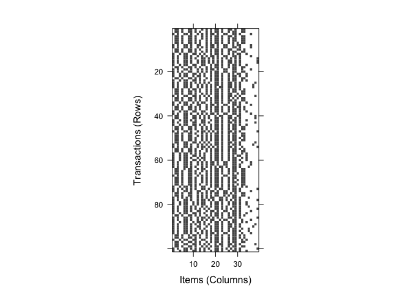
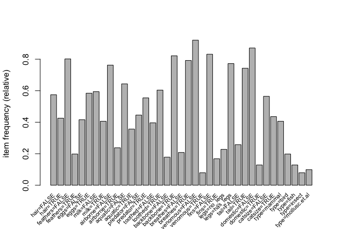
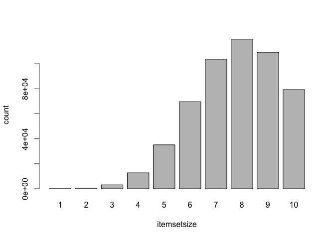
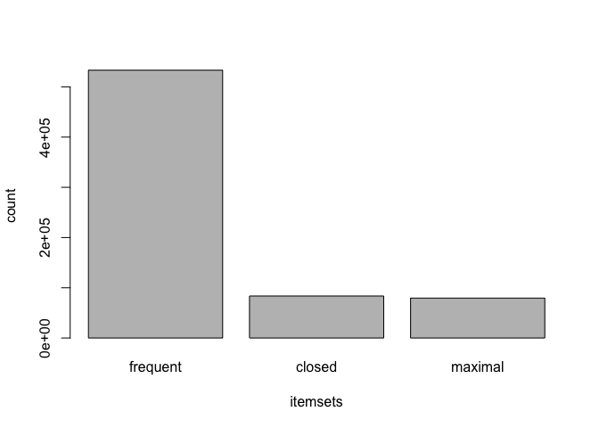
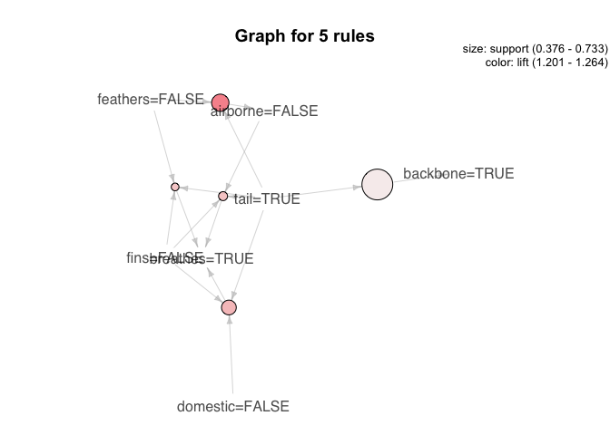
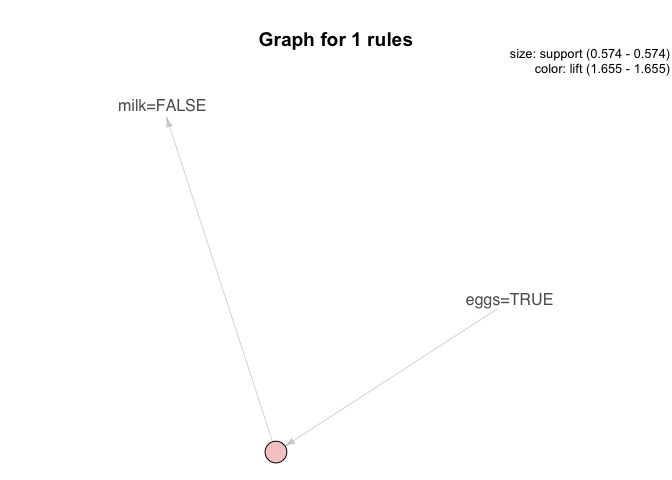

Resumen del experimento
=======================

En este análisis del conjunto de datos **Zoo** de la librería *mlbench*
por medio de reglas de asociación, se intentan encontrar aquellas
relaciones existentes entre características de distintas especies de
animales. Para ello, se harán uso de las funciones existentes dentro de
los paquetes *arules* y *arulesViz*. Las conclusiones obtenidas tras
este experimento se pueden entonctrar en el epígrafe **Resultado y
conclusiones** de este mismo documento.

Configuración del entorno del experimento
=========================================

A continuación, se lleva a cabo la carga de todas aquellas librerías,
funciones y datos necesarios para llevar a cabo el experimento de forma
exitosa

Carga de librerías necesarias
-----------------------------

    library(arules)
    library(arulesViz)
    library(mlbench)

Carga del conjunto de datos: Zoo
--------------------------------

Cargamos el conjunto de datos **Zoo** de la librería *mlbench* y
visualizamos las primeras líneas:

    data(Zoo)
    Zoo[1:2,] 

    ##          hair feathers  eggs milk airborne aquatic predator toothed
    ## aardvark TRUE    FALSE FALSE TRUE    FALSE   FALSE     TRUE    TRUE
    ## antelope TRUE    FALSE FALSE TRUE    FALSE   FALSE    FALSE    TRUE
    ##          backbone breathes venomous  fins legs  tail domestic catsize
    ## aardvark     TRUE     TRUE    FALSE FALSE    4 FALSE    FALSE    TRUE
    ## antelope     TRUE     TRUE    FALSE FALSE    4  TRUE    FALSE    TRUE
    ##            type
    ## aardvark mammal
    ## antelope mammal

Análisis exploratorio de datos (EDA)
====================================

A fin de tener una ligera idea de la composición del conjunto de datos
que nos atañe, se muestran las principales caracteríticas del mismo y
tanto su estructura como la de sus variables

Estructura del conjunto de datos
--------------------------------

En primer lugar, visualizamos la estructura del conjunto de datos

    str(Zoo)

    ## 'data.frame':    101 obs. of  17 variables:
    ##  $ hair    : logi  TRUE TRUE FALSE TRUE TRUE TRUE ...
    ##  $ feathers: logi  FALSE FALSE FALSE FALSE FALSE FALSE ...
    ##  $ eggs    : logi  FALSE FALSE TRUE FALSE FALSE FALSE ...
    ##  $ milk    : logi  TRUE TRUE FALSE TRUE TRUE TRUE ...
    ##  $ airborne: logi  FALSE FALSE FALSE FALSE FALSE FALSE ...
    ##  $ aquatic : logi  FALSE FALSE TRUE FALSE FALSE FALSE ...
    ##  $ predator: logi  TRUE FALSE TRUE TRUE TRUE FALSE ...
    ##  $ toothed : logi  TRUE TRUE TRUE TRUE TRUE TRUE ...
    ##  $ backbone: logi  TRUE TRUE TRUE TRUE TRUE TRUE ...
    ##  $ breathes: logi  TRUE TRUE FALSE TRUE TRUE TRUE ...
    ##  $ venomous: logi  FALSE FALSE FALSE FALSE FALSE FALSE ...
    ##  $ fins    : logi  FALSE FALSE TRUE FALSE FALSE FALSE ...
    ##  $ legs    : int  4 4 0 4 4 4 4 0 0 4 ...
    ##  $ tail    : logi  FALSE TRUE TRUE FALSE TRUE TRUE ...
    ##  $ domestic: logi  FALSE FALSE FALSE FALSE FALSE FALSE ...
    ##  $ catsize : logi  TRUE TRUE FALSE TRUE TRUE TRUE ...
    ##  $ type    : Factor w/ 7 levels "mammal","bird",..: 1 1 4 1 1 1 1 4 4 1 ...

Podemos apreciar que:

-   El conjunto de datos se compone de **101 observaciones**
    correspondientes a animales, de los cuales se diferencian **17
    variables**.
-   Las variables son principalmente de tipo booleano, exceptuando al
    número de piernas (**legs**), que es de tipo numérico entero y el
    tipo de animal (**type**), que se corresponde con una variable
    categórica numérica.

Valores perdidos
----------------

Calculamos los valores perdidos para cada una de las variables:

    apply(Zoo, MARGIN = 2, function(x) sum(is.na(x)))

    ##     hair feathers     eggs     milk airborne  aquatic predator  toothed 
    ##        0        0        0        0        0        0        0        0 
    ## backbone breathes venomous     fins     legs     tail domestic  catsize 
    ##        0        0        0        0        0        0        0        0 
    ##     type 
    ##        0

Tal y como se puede apreciar, **no hay variables con valores perdidos**
dentro de este conjunto de datos

Transformaciones necesarias
---------------------------

A continuación se llevan a cabo algunas transformaciones necesarias, en
nuestro caso, para poder adecuar la BD, de forma que pueda transformarse
a un conjunto de transacciones. Así, se transforman las siguientes
variables:

-   legs que es una variable de tipo numérica. Para poder transformar la
    BD a un conjunto de transacciones, primero tendremos que dividir en
    intervalos esta variable. Aplicar un único corte en 0, generando 2
    intervalos con las etiquetas no\_legs y has\_legs (tiene o no tiene
    piernas).

<!-- -->

    Zoo[["legs"]] <- ordered(cut(Zoo[["legs"]], 
                                 c(-Inf,0,max(Zoo[["legs"]])), 
                                 labels = c("no_legs", "has_legs")))

-   En esta BD la mayoría de las variables son lógicas. Por lo tanto,
    será necesario cambiarlas todas a tipo factor antes de convertir la
    BD en transacciones para que el método apriori considere también los
    casos en los que las variables toman el valor false:

<!-- -->

    cols <- as.logical(lapply(Zoo, is.logical))
    Zoo[cols] <- lapply(Zoo[cols], as.factor)  
    rm(cols)

Análisis de reglas de asociación
================================

A continuación, se lleva a cabo el análisis de reglas de asociación.

Conversión del data-frame en conjunto de trasanciones
-----------------------------------------------------

El primer paso del análisis de reglas de asociación implica obtener un
conjunto de transacciones sobre el cual llevar a cabo la búsqueda de
reglas. Convertimos el data.frame en un conjunto de transacciones con la
función as y lo guardamos en la variable ZooT:

    ZooT <- as(Zoo, "transactions")
    summary(ZooT)

    ## transactions as itemMatrix in sparse format with
    ##  101 rows (elements/itemsets/transactions) and
    ##  39 columns (items) and a density of 0.4358974 
    ## 
    ## most frequent items:
    ## venomous=FALSE domestic=FALSE     fins=FALSE  backbone=TRUE feathers=FALSE 
    ##             93             88             84             83             81 
    ##        (Other) 
    ##           1288 
    ## 
    ## element (itemset/transaction) length distribution:
    ## sizes
    ##  17 
    ## 101 
    ## 
    ##    Min. 1st Qu.  Median    Mean 3rd Qu.    Max. 
    ##      17      17      17      17      17      17 
    ## 
    ## includes extended item information - examples:
    ##           labels variables levels
    ## 1     hair=FALSE      hair  FALSE
    ## 2      hair=TRUE      hair   TRUE
    ## 3 feathers=FALSE  feathers  FALSE
    ## 
    ## includes extended transaction information - examples:
    ##   transactionID
    ## 1      aardvark
    ## 2      antelope
    ## 3          bass

Tal y como podemos apreciar, al no haber valores perdidos, **todos las
transacciones son del tamaño del número de variables (17)**.

### Representación de los items dentro de las transacciones

Representamos gráficamente la distribución de los items en las
transacciones:

    image(ZooT)

### Items más frecuentes

Vemos gráficamente que items son los más importantes. Usamos como
soporte mínimo **0.05**, para encontrar aquellos **items que afectan
como mínimo a 5 animales** (5/101):

    itemFrequencyPlot(ZooT, support = 0.05, cex.names=0.7)

Como se puede apreciar, tres de los items más frecuentes, que a su vez
se corresponden con los items de mayor soporte, son **no-venenosos**,
**no-domésticos** y **no-plumas**.

Itemsets
--------

A continuación, calculamos los distintos itemsets que se dan dentro de
las transacciones, considerando por cuestiones prácticas aquellos que
son frecuentes, los maximales y los cerrados.

### Itemsets frecuentes

Usamos apriori para extraer los itemsets frecuentes que afectan como
mínimo a 5 animales (support = 0.05). Para ello ponemos en la lista de
parámetros target="frequent":

    iZoo <- apriori(ZooT, parameter = list(support = 0.05, target="frequent"))

    ## Apriori
    ## 
    ## Parameter specification:
    ##  confidence minval smax arem  aval originalSupport maxtime support minlen
    ##          NA    0.1    1 none FALSE            TRUE       5    0.05      1
    ##  maxlen            target   ext
    ##      10 frequent itemsets FALSE
    ## 
    ## Algorithmic control:
    ##  filter tree heap memopt load sort verbose
    ##     0.1 TRUE TRUE  FALSE TRUE    2    TRUE
    ## 
    ## Absolute minimum support count: 5 
    ## 
    ## set item appearances ...[0 item(s)] done [0.00s].
    ## set transactions ...[39 item(s), 101 transaction(s)] done [0.00s].
    ## sorting and recoding items ... [37 item(s)] done [0.00s].
    ## creating transaction tree ... done [0.00s].
    ## checking subsets of size 1 2 3 4 5 6 7 8 9 10 done [0.22s].
    ## writing ... [533181 set(s)] done [0.07s].
    ## creating S4 object  ... done [0.40s].

    iZoo <- sort(iZoo, by="support")
    inspect(head(iZoo, n=10))

    ##      items                           support   count
    ## [1]  {venomous=FALSE}                0.9207921 93   
    ## [2]  {domestic=FALSE}                0.8712871 88   
    ## [3]  {fins=FALSE}                    0.8316832 84   
    ## [4]  {backbone=TRUE}                 0.8217822 83   
    ## [5]  {feathers=FALSE}                0.8019802 81   
    ## [6]  {venomous=FALSE,domestic=FALSE} 0.8019802 81   
    ## [7]  {breathes=TRUE}                 0.7920792 80   
    ## [8]  {backbone=TRUE,venomous=FALSE}  0.7821782 79   
    ## [9]  {legs=has_legs}                 0.7722772 78   
    ## [10] {airborne=FALSE}                0.7623762 77

Se han obtenido más de 500.000 itemsets frecuentes. Asu vez, se aprecia
como de los diez primeros de mayor soporte, la mayoría son de tamaño 1,
exceptuando **{venomous=FALSE,domestic=FALSE}** y
**{backbone=TRUE,venomous=FALSE}**.

#### Tamaño de los itemsets frecuentes

Podemos consultar con la función size el tamaño de los itemsets
frecuentes. Así representamos el tamaño de los distintos itemsets por
medio de un diagrama de barras.

    barplot(table(size(iZoo)), xlab="itemsetsize", ylab="count")

A su vez, podemos inspeccionar aquellos itemsets con un tamaño más
grande:

    inspect(head(iZoo[size(iZoo)==4]))

    ##     items              support count
    ## [1] {breathes=TRUE,                 
    ##      venomous=FALSE,                
    ##      fins=FALSE,                    
    ##      legs=has_legs}  0.6732673    68
    ## [2] {backbone=TRUE,                 
    ##      breathes=TRUE,                 
    ##      fins=FALSE,                    
    ##      legs=has_legs}  0.6237624    63
    ## [3] {backbone=TRUE,                 
    ##      breathes=TRUE,                 
    ##      venomous=FALSE,                
    ##      legs=has_legs}  0.6237624    63
    ## [4] {backbone=TRUE,                 
    ##      breathes=TRUE,                 
    ##      venomous=FALSE,                
    ##      fins=FALSE}     0.6237624    63
    ## [5] {backbone=TRUE,                 
    ##      venomous=FALSE,                
    ##      fins=FALSE,                    
    ##      legs=has_legs}  0.6138614    62
    ## [6] {venomous=FALSE,                
    ##      fins=FALSE,                    
    ##      legs=has_legs,                 
    ##      domestic=FALSE} 0.6138614    62

### Itemsets maximales

Como son muchos itemsets frecuentes, podemos quedarnos solo con los
itemsets maximales:

    imaxZoo<-iZoo[is.maximal(iZoo)]
    inspect(head(sort(imaxZoo, by="support")))

    ##     items              support count
    ## [1] {hair=TRUE,                     
    ##      feathers=FALSE,                
    ##      eggs=FALSE,                    
    ##      milk=TRUE,                     
    ##      toothed=TRUE,                  
    ##      backbone=TRUE,                 
    ##      breathes=TRUE,                 
    ##      venomous=FALSE,                
    ##      legs=has_legs,                 
    ##      type=mammal}    0.3663366    37
    ## [2] {hair=TRUE,                     
    ##      feathers=FALSE,                
    ##      eggs=FALSE,                    
    ##      milk=TRUE,                     
    ##      airborne=FALSE,                
    ##      toothed=TRUE,                  
    ##      backbone=TRUE,                 
    ##      breathes=TRUE,                 
    ##      venomous=FALSE,                
    ##      type=mammal}    0.3564356    36
    ## [3] {hair=TRUE,                     
    ##      feathers=FALSE,                
    ##      eggs=FALSE,                    
    ##      milk=TRUE,                     
    ##      toothed=TRUE,                  
    ##      backbone=TRUE,                 
    ##      breathes=TRUE,                 
    ##      fins=FALSE,                    
    ##      legs=has_legs,                 
    ##      type=mammal}    0.3564356    36
    ## [4] {hair=TRUE,                     
    ##      feathers=FALSE,                
    ##      eggs=FALSE,                    
    ##      milk=TRUE,                     
    ##      toothed=TRUE,                  
    ##      breathes=TRUE,                 
    ##      venomous=FALSE,                
    ##      fins=FALSE,                    
    ##      legs=has_legs,                 
    ##      type=mammal}    0.3564356    36
    ## [5] {hair=TRUE,                     
    ##      eggs=FALSE,                    
    ##      milk=TRUE,                     
    ##      toothed=TRUE,                  
    ##      backbone=TRUE,                 
    ##      breathes=TRUE,                 
    ##      venomous=FALSE,                
    ##      fins=FALSE,                    
    ##      legs=has_legs,                 
    ##      type=mammal}    0.3564356    36
    ## [6] {hair=TRUE,                     
    ##      feathers=FALSE,                
    ##      eggs=FALSE,                    
    ##      milk=TRUE,                     
    ##      toothed=TRUE,                  
    ##      backbone=TRUE,                 
    ##      venomous=FALSE,                
    ##      fins=FALSE,                    
    ##      legs=has_legs,                 
    ##      type=mammal}    0.3564356    36

### Itemsets cerrados

También podemos extraer los itemsets cerrados:

    icloZoo <- iZoo[is.closed(iZoo)]
    inspect(head(sort(icloZoo, by="support")))

    ##     items                           support   count
    ## [1] {venomous=FALSE}                0.9207921 93   
    ## [2] {domestic=FALSE}                0.8712871 88   
    ## [3] {fins=FALSE}                    0.8316832 84   
    ## [4] {backbone=TRUE}                 0.8217822 83   
    ## [5] {feathers=FALSE}                0.8019802 81   
    ## [6] {venomous=FALSE,domestic=FALSE} 0.8019802 81

### Comparativa entre el número de itemsets

El recuento del número de itemsets frecuentes, maximales y cerrados es
el siguiente:

    barplot(c(frequent=length(iZoo), closed=length(icloZoo),
              maximal=length(imaxZoo)), ylab="count", xlab="itemsets")

Tal y como podemos apreciar, el número de itemsets frecuentes supera
ampliamente los 500.000, por lo que habría que llevar a cabo un filtrado
posterior a fin de hacer este análisis abordable o directamente, hacer
uso de los itemsets cerrados o maximales. En nuestro caso **haremos uso
de los itemsets cerrados para la generación de reglas**.

Análisis de reglas de asociación
================================

A continuación, se lleva a cabo el análisis de las reglas de asociación
a fin de obtener aquellas relaciones mas relevantes que se dan entre
atributos.

Minado de reglas
----------------

Como bien hemos dicho, haremos uso de los itemsets cerrados para el
minado de reglas. Al usar itemsets cerrados, limitamos el soporte a 0.05
(que afecten a 5 animales como mínimo: 5/101), pues los itemsets
cerrados son frecuentes. La confianza la establecemos en 0.7 y una
longitud de reglas de 2 a 9.

    closed_rules <- ruleInduction(icloZoo, ZooT, confidence = 0.7)
    closed_rules <- closed_rules[size(items(closed_rules)) < 10 & size(items(closed_rules)) > 1]

Primeras reglas del conjunto obtenido y medidas de calidad

    inspect(head(closed_rules))

    ##     lhs                 rhs              support   confidence lift     
    ## [1] {domestic=FALSE} => {venomous=FALSE} 0.8019802 0.9204545  0.9996334
    ## [2] {venomous=FALSE} => {domestic=FALSE} 0.8019802 0.8709677  0.9996334
    ## [3] {venomous=FALSE} => {backbone=TRUE}  0.7821782 0.8494624  1.0336831
    ## [4] {backbone=TRUE}  => {venomous=FALSE} 0.7821782 0.9518072  1.0336831
    ## [5] {legs=has_legs}  => {fins=FALSE}     0.7623762 0.9871795  1.1869658
    ## [6] {fins=FALSE}     => {legs=has_legs}  0.7623762 0.9166667  1.1869658
    ##     itemset
    ## [1]  6     
    ## [2]  6     
    ## [3]  8     
    ## [4]  8     
    ## [5] 11     
    ## [6] 11

Reglas ordenadas por confianza

    rulesSorted <- sort(closed_rules, by = "confidence")
    inspect(head(rulesSorted))

    ##     lhs                 rhs               support confidence     lift itemset
    ## [1] {venomous=FALSE,                                                         
    ##      tail=TRUE}      => {backbone=TRUE} 0.7029703          1 1.216867      27
    ## [2] {aquatic=FALSE}  => {fins=FALSE}    0.6435644          1 1.202381      40
    ## [3] {aquatic=FALSE,                                                          
    ##      breathes=TRUE}  => {fins=FALSE}    0.6336634          1 1.202381      46
    ## [4] {backbone=TRUE,                                                          
    ##      legs=has_legs}  => {breathes=TRUE} 0.6336634          1 1.262500      49
    ## [5] {backbone=TRUE,                                                          
    ##      fins=FALSE,                                                             
    ##      legs=has_legs}  => {breathes=TRUE} 0.6237624          1 1.262500      55
    ## [6] {backbone=TRUE,                                                          
    ##      venomous=FALSE,                                                         
    ##      legs=has_legs}  => {breathes=TRUE} 0.6237624          1 1.262500      56

Eliminación de reglas redundantes
---------------------------------

Eliminamos aquellas reglas que resultan reduntantes a fin de disminuir
nuestro set de reglas a analizar:

    subsetMatrix <- is.subset(rulesSorted, rulesSorted)
    subsetMatrix[lower.tri(subsetMatrix, diag=TRUE)] <- FALSE
    redundant <-colSums(subsetMatrix, na.rm=TRUE) >= 1
    rulesPruned<-rulesSorted[!redundant]
    inspect(head(rulesPruned))

    ##     lhs                 rhs                support confidence     lift itemset
    ## [1] {venomous=FALSE,                                                          
    ##      tail=TRUE}      => {backbone=TRUE}  0.7029703          1 1.216867      27
    ## [2] {aquatic=FALSE}  => {fins=FALSE}     0.6435644          1 1.202381      40
    ## [3] {backbone=TRUE,                                                           
    ##      legs=has_legs}  => {breathes=TRUE}  0.6336634          1 1.262500      49
    ## [4] {backbone=TRUE,                                                           
    ##      venomous=FALSE,                                                          
    ##      fins=FALSE}     => {breathes=TRUE}  0.6237624          1 1.262500      57
    ## [5] {toothed=TRUE,                                                            
    ##      backbone=TRUE}  => {feathers=FALSE} 0.6039604          1 1.246914      62
    ## [6] {legs=has_legs,                                                           
    ##      tail=TRUE}      => {breathes=TRUE}  0.5643564          1 1.262500      87

Resultados y conclusiones
=========================

De entre todos los ejemplos de reglas que podríamos extraer, nos
centraremos en algunas de aquellas destaquen alguna de las
características de los animales, en nuestro caso que tengan cola o que
sean animales voladores y posteriormente, buscaremos reglas que definan
la tipología animal concreta establecida para cada animal (mamífero,
anfibio...).

Reglas de características de animales concretas
-----------------------------------------------

### Reglas para animales que tienen cola

A continuación vamos a estudiar aquellas reglas que contienen dentro del
precedente milk = true:

    rulesTailTrue <- subset(rulesPruned, subset = lhs %in% "tail=TRUE" & lift > 1.2 & confidence < 1)
    inspect(head(sort(rulesTailTrue, by="confidence")))

    ##     lhs                 rhs                support confidence     lift itemset
    ## [1] {tail=TRUE}      => {backbone=TRUE}  0.7326733  0.9866667 1.200643      16
    ## [2] {fins=FALSE,                                                              
    ##      tail=TRUE,                                                               
    ##      domestic=FALSE} => {breathes=TRUE}  0.4851485  0.9800000 1.237250     184
    ## [3] {airborne=FALSE,                                                          
    ##      fins=FALSE,                                                              
    ##      tail=TRUE}      => {breathes=TRUE}  0.3960396  0.9756098 1.231707     401
    ## [4] {feathers=FALSE,                                                          
    ##      fins=FALSE,                                                              
    ##      tail=TRUE}      => {breathes=TRUE}  0.3762376  0.9743590 1.230128     487
    ## [5] {feathers=FALSE,                                                          
    ##      tail=TRUE}      => {airborne=FALSE} 0.5247525  0.9636364 1.263991     126

Al estudiar aquellos animales que tienen cola, apreciamos los siguientes
hechos:

-   Si bien parece que suele estar bastante relacionado que tener cola
    implica que el animal tenga esqueleto, vemos como en la regla 1 esto
    no es así en la totalidad de casos. Así, visualizamos los casos en
    los que esto no se da y descubrimos que la única excepción es el
    **escorpión**:

<!-- -->

    subset(Zoo, tail == TRUE & backbone == FALSE)

    ##           hair feathers  eggs  milk airborne aquatic predator toothed
    ## scorpion FALSE    FALSE FALSE FALSE    FALSE   FALSE     TRUE   FALSE
    ##          backbone breathes venomous  fins     legs tail domestic catsize
    ## scorpion    FALSE     TRUE     TRUE FALSE has_legs TRUE    FALSE   FALSE
    ##                   type
    ## scorpion mollusc.et.al

-   Tabién se aprecia una relación entre aquellos animales que tienen
    cola, no tienen aletas, no son domésticos y respiran aire, si bien
    también existen excepciones, como la **serpiente de agua**, que no
    respira aire:

<!-- -->

    subset(Zoo, tail == TRUE & fins == FALSE & domestic==FALSE & breathes == FALSE)

    ##           hair feathers  eggs  milk airborne aquatic predator toothed
    ## seasnake FALSE    FALSE FALSE FALSE    FALSE    TRUE     TRUE    TRUE
    ##          backbone breathes venomous  fins    legs tail domestic catsize
    ## seasnake     TRUE    FALSE     TRUE FALSE no_legs TRUE    FALSE   FALSE
    ##             type
    ## seasnake reptile

-   Si bien todas la mayoría de especies que tienen cola, no vuelan y
    sin aletas, suelen respirar aire, este no es el caso tampoco de **la
    serpiente de agua**, tal y como podemos apreciar:

<!-- -->

    subset(Zoo, tail == TRUE & airborne == FALSE & fins == FALSE & breathes == FALSE)

    ##           hair feathers  eggs  milk airborne aquatic predator toothed
    ## seasnake FALSE    FALSE FALSE FALSE    FALSE    TRUE     TRUE    TRUE
    ##          backbone breathes venomous  fins    legs tail domestic catsize
    ## seasnake     TRUE    FALSE     TRUE FALSE no_legs TRUE    FALSE   FALSE
    ##             type
    ## seasnake reptile

Tanto estas conclusiones, como muchas otras tantas que se pueden obtener
acerca de los animales que tienen cola, pueden apreciarse en el
siguiente grafo:

    plot(rulesTailTrue, method="graph")

### Reglas para animales que ponen huevos

A continuación vamos a estudiar aquellas reglas que contienen dentro del
precedente eggs = true:

    rulesEggsTrue <- subset(rulesPruned, subset = lhs %in% "eggs=TRUE" & lift > 1.2 & confidence < 1)
    inspect(head(sort(rulesEggsTrue, by="confidence")))

    ##     lhs            rhs          support   confidence lift     itemset
    ## [1] {eggs=TRUE} => {milk=FALSE} 0.5742574 0.9830508  1.654802 82

Al estudiar aquellos animales aereos, apreciamos una única regla de
importancia sufieciente en base a nuestros criterios:

-   Aquellos animales ponedores de huevos, no amamantan a sus crias, tal
    y como podemos observar:

<!-- -->

    head(subset(Zoo, eggs == TRUE & milk == FALSE))

    ##          hair feathers eggs  milk airborne aquatic predator toothed
    ## bass    FALSE    FALSE TRUE FALSE    FALSE    TRUE     TRUE    TRUE
    ## carp    FALSE    FALSE TRUE FALSE    FALSE    TRUE    FALSE    TRUE
    ## catfish FALSE    FALSE TRUE FALSE    FALSE    TRUE     TRUE    TRUE
    ## chicken FALSE     TRUE TRUE FALSE     TRUE   FALSE    FALSE   FALSE
    ## chub    FALSE    FALSE TRUE FALSE    FALSE    TRUE     TRUE    TRUE
    ## clam    FALSE    FALSE TRUE FALSE    FALSE   FALSE     TRUE   FALSE
    ##         backbone breathes venomous  fins     legs  tail domestic catsize
    ## bass        TRUE    FALSE    FALSE  TRUE  no_legs  TRUE    FALSE   FALSE
    ## carp        TRUE    FALSE    FALSE  TRUE  no_legs  TRUE     TRUE   FALSE
    ## catfish     TRUE    FALSE    FALSE  TRUE  no_legs  TRUE    FALSE   FALSE
    ## chicken     TRUE     TRUE    FALSE FALSE has_legs  TRUE     TRUE   FALSE
    ## chub        TRUE    FALSE    FALSE  TRUE  no_legs  TRUE    FALSE   FALSE
    ## clam       FALSE    FALSE    FALSE FALSE  no_legs FALSE    FALSE   FALSE
    ##                  type
    ## bass             fish
    ## carp             fish
    ## catfish          fish
    ## chicken          bird
    ## chub             fish
    ## clam    mollusc.et.al

Sin embargo encontramos una excepción, como es el **ornitorrinco**, que
como bien sabemos, es un mamífero y si amamanta a sus crias:

    subset(Zoo, eggs == TRUE & milk == TRUE)

    ##          hair feathers eggs milk airborne aquatic predator toothed
    ## platypus TRUE    FALSE TRUE TRUE    FALSE    TRUE     TRUE   FALSE
    ##          backbone breathes venomous  fins     legs tail domestic catsize
    ## platypus     TRUE     TRUE    FALSE FALSE has_legs TRUE    FALSE    TRUE
    ##            type
    ## platypus mammal

Esta regla puede apreciarse en el siguiente grafo:

    plot(rulesEggsTrue, method="graph")

Reglas para la tipología animal
-------------------------------

A continuación, hallaremos las reglas que solo incluyen en el
consecuente el tipo de animal. Seremos algo más permisivos con la medida
de confianza de estas reglas y incrementaremos su longitud:

    rulesType <- apriori(ZooT, parameter = list(support = 0.05, confidence = 0.8, minlen = 2, maxlen = 6),
                     appearance = list(rhs=paste0("type=", unique(Zoo$type))))

    ## Apriori
    ## 
    ## Parameter specification:
    ##  confidence minval smax arem  aval originalSupport maxtime support minlen
    ##         0.8    0.1    1 none FALSE            TRUE       5    0.05      2
    ##  maxlen target   ext
    ##       6  rules FALSE
    ## 
    ## Algorithmic control:
    ##  filter tree heap memopt load sort verbose
    ##     0.1 TRUE TRUE  FALSE TRUE    2    TRUE
    ## 
    ## Absolute minimum support count: 5 
    ## 
    ## set item appearances ...[7 item(s)] done [0.00s].
    ## set transactions ...[39 item(s), 101 transaction(s)] done [0.00s].
    ## sorting and recoding items ... [37 item(s)] done [0.00s].
    ## creating transaction tree ... done [0.00s].
    ## checking subsets of size 1 2 3 4 5 6 done [0.03s].
    ## writing ... [21138 rule(s)] done [0.01s].
    ## creating S4 object  ... done [0.01s].

    rulesSortedType <- sort(rulesType, by = "confidence")
    subsetMatrix <- is.subset(rulesSortedType, rulesSortedType)
    subsetMatrix[lower.tri(subsetMatrix, diag=TRUE)] <- FALSE
    redundant <-colSums(subsetMatrix, na.rm=TRUE) >= 1
    rulesPrunedType<-rulesSortedType[!redundant]
    inspect(head(rulesPrunedType))

    ##     lhs                 rhs                     support confidence      lift count
    ## [1] {feathers=TRUE}  => {type=bird}          0.19801980          1  5.050000    20
    ## [2] {milk=TRUE}      => {type=mammal}        0.40594059          1  2.463415    41
    ## [3] {airborne=TRUE,                                                               
    ##      backbone=FALSE} => {type=insect}        0.05940594          1 12.625000     6
    ## [4] {airborne=TRUE,                                                               
    ##      tail=FALSE}     => {type=insect}        0.05940594          1 12.625000     6
    ## [5] {backbone=FALSE,                                                              
    ##      breathes=FALSE} => {type=mollusc.et.al} 0.06930693          1 10.100000     7
    ## [6] {aquatic=TRUE,                                                                
    ##      backbone=FALSE} => {type=mollusc.et.al} 0.05940594          1 10.100000     6

### Reglas para mamíferos

A continuación se obtienen reglas para animales de tipo mamífero

    rulesType <- subset(rulesPrunedType, lift > 1.2 & support > 0.4 & rhs %in% "type=mammal")
    inspect(head(sort(rulesType, by="lift", decreasing = TRUE)))

    ##     lhs                 rhs             support confidence     lift count
    ## [1] {milk=TRUE}      => {type=mammal} 0.4059406  1.0000000 2.463415    41
    ## [2] {feathers=FALSE,                                                     
    ##      backbone=TRUE,                                                      
    ##      breathes=TRUE,                                                      
    ##      venomous=FALSE} => {type=mammal} 0.4059406  0.8723404 2.148936    41
    ## [3] {feathers=FALSE,                                                     
    ##      backbone=TRUE,                                                      
    ##      breathes=TRUE}  => {type=mammal} 0.4059406  0.8367347 2.061224    41

Algunas reglas básicas para mamíferos son:

-   Dan leche a sus crias.
-   No tienen plumas, si esqueleto, respiran aire y no son venenosos.

### Reglas para insectos

A continuación se obtienen reglas para animales de tipo insecto

    rulesType <- subset(rulesPrunedType, lift > 1.2 & support > 0.07 & rhs %in% "type=insect")
    inspect(head(sort(rulesType, by="lift", decreasing = TRUE)))

    ##     lhs                 rhs              support confidence   lift count
    ## [1] {aquatic=FALSE,                                                     
    ##      backbone=FALSE,                                                    
    ##      legs=has_legs,                                                     
    ##      tail=FALSE}     => {type=insect} 0.07920792          1 12.625     8
    ## [2] {backbone=FALSE,                                                    
    ##      breathes=TRUE,                                                     
    ##      legs=has_legs,                                                     
    ##      tail=FALSE}     => {type=insect} 0.07920792          1 12.625     8
    ## [3] {eggs=TRUE,                                                         
    ##      aquatic=FALSE,                                                     
    ##      backbone=FALSE,                                                    
    ##      legs=has_legs}  => {type=insect} 0.07920792          1 12.625     8
    ## [4] {eggs=TRUE,                                                         
    ##      backbone=FALSE,                                                    
    ##      breathes=TRUE,                                                     
    ##      legs=has_legs}  => {type=insect} 0.07920792          1 12.625     8
    ## [5] {aquatic=FALSE,                                                     
    ##      toothed=FALSE,                                                     
    ##      legs=has_legs,                                                     
    ##      tail=FALSE}     => {type=insect} 0.07920792          1 12.625     8
    ## [6] {toothed=FALSE,                                                     
    ##      breathes=TRUE,                                                     
    ##      legs=has_legs,                                                     
    ##      tail=FALSE}     => {type=insect} 0.07920792          1 12.625     8

La regla básicas que más caracteriza a los insectos es:

-   No son de tipo acuático, no tienen esqueleto, tienen piernas pero no
    cola.
-   Además, a esta regla anterior puede incluirse que respiran y que
    ponen huevos.

### Reglas para pajaros

A continuación se obtienen reglas para animales de tipo pájaro:

    rulesType <- subset(rulesPrunedType, lift > 1.2 & support > 0.15 & rhs %in% "type=bird")
    inspect(head(sort(rulesType, by="lift", decreasing = TRUE)))

    ##     lhs                rhs           support confidence lift count
    ## [1] {feathers=TRUE} => {type=bird} 0.1980198          1 5.05    20
    ## [2] {airborne=TRUE,                                               
    ##      toothed=FALSE,                                               
    ##      tail=TRUE}     => {type=bird} 0.1584158          1 5.05    16
    ## [3] {airborne=TRUE,                                               
    ##      toothed=FALSE,                                               
    ##      backbone=TRUE} => {type=bird} 0.1584158          1 5.05    16
    ## [4] {hair=FALSE,                                                  
    ##      airborne=TRUE,                                               
    ##      tail=TRUE}     => {type=bird} 0.1584158          1 5.05    16
    ## [5] {hair=FALSE,                                                  
    ##      airborne=TRUE,                                               
    ##      backbone=TRUE} => {type=bird} 0.1584158          1 5.05    16
    ## [6] {eggs=TRUE,                                                   
    ##      airborne=TRUE,                                               
    ##      tail=TRUE}     => {type=bird} 0.1584158          1 5.05    16

Las reglas básicas que más caracterizan a los pájaros son:

-   Tienen plumas.
-   Vuelan, no tienen dientes pero si cola.
-   Ponen huevos y tienen esqueleto.

### Reglas para moluscos et al.

A continuación se obtienen reglas para animales de tipo molusco y
similares:

    rulesType <- subset(rulesPrunedType, rhs %in% "type=mollusc.et.al")
    inspect(head(sort(rulesType, by="lift", decreasing = TRUE)))

    ##     lhs                 rhs                     support confidence lift count
    ## [1] {backbone=FALSE,                                                         
    ##      breathes=FALSE} => {type=mollusc.et.al} 0.06930693          1 10.1     7
    ## [2] {aquatic=TRUE,                                                           
    ##      backbone=FALSE} => {type=mollusc.et.al} 0.05940594          1 10.1     6
    ## [3] {breathes=FALSE,                                                         
    ##      tail=FALSE}     => {type=mollusc.et.al} 0.06930693          1 10.1     7
    ## [4] {toothed=FALSE,                                                          
    ##      breathes=FALSE} => {type=mollusc.et.al} 0.06930693          1 10.1     7
    ## [5] {airborne=FALSE,                                                         
    ##      predator=TRUE,                                                          
    ##      backbone=FALSE} => {type=mollusc.et.al} 0.07920792          1 10.1     8
    ## [6] {eggs=TRUE,                                                              
    ##      breathes=FALSE,                                                         
    ##      fins=FALSE}     => {type=mollusc.et.al} 0.06930693          1 10.1     7

Las reglas básicas que más caracterizan a los moluscos son:

-   No tienen esqueleto ni respiran aire.
-   No tienen esqueleto y son de tipo acuático.
-   Similares a estas reglas tanto en confianza y en lift, encontramos
    otras que consideran que ponen huevos, no tienen dientes, son
    depredadores y no tienen cola.

### Reglas para peces

A continuación se obtienen reglas para animales de tipo molusco y
similares:

    rulesType <- subset(rulesPrunedType, rhs %in% "type=fish")
    inspect(head(sort(rulesType, by="lift", decreasing = TRUE)))

    ##     lhs                 rhs            support confidence     lift count
    ## [1] {breathes=FALSE,                                                    
    ##      fins=TRUE}      => {type=fish} 0.12871287          1 7.769231    13
    ## [2] {fins=TRUE,                                                         
    ##      catsize=FALSE}  => {type=fish} 0.08910891          1 7.769231     9
    ## [3] {eggs=TRUE,                                                         
    ##      fins=TRUE}      => {type=fish} 0.12871287          1 7.769231    13
    ## [4] {milk=FALSE,                                                        
    ##      fins=TRUE}      => {type=fish} 0.12871287          1 7.769231    13
    ## [5] {eggs=TRUE,                                                         
    ##      toothed=TRUE,                                                      
    ##      breathes=FALSE} => {type=fish} 0.12871287          1 7.769231    13
    ## [6] {eggs=TRUE,                                                         
    ##      breathes=FALSE,                                                    
    ##      tail=TRUE}      => {type=fish} 0.12871287          1 7.769231    13

La regla básica que más caracterizan a los peces es:

-   No respiran aire, tienen aletas y ponen huevos.
-   Se consideran otros items en reglas de similar medida de confianza,
    soporte y lift, como que no son de tamaño parecido al de un gato, no
    ponen leche y tienen dientes.

### Reglas para anfibios

Debido a que el número de ocurrencias de anfibios es mínimo, es
practicamente imposible que se encuentren itemsets frecuentes de los
cuales obtener reglas. Es por ello que generamos reglas para con soporte
menos restrictivo:

    rulesType <- apriori(ZooT, parameter = list(support = 0.02, confidence = 0.8, minlen = 2, maxlen = 8),
                     appearance = list(rhs="type=amphibian"))

    ## Apriori
    ## 
    ## Parameter specification:
    ##  confidence minval smax arem  aval originalSupport maxtime support minlen
    ##         0.8    0.1    1 none FALSE            TRUE       5    0.02      2
    ##  maxlen target   ext
    ##       8  rules FALSE
    ## 
    ## Algorithmic control:
    ##  filter tree heap memopt load sort verbose
    ##     0.1 TRUE TRUE  FALSE TRUE    2    TRUE
    ## 
    ## Absolute minimum support count: 2 
    ## 
    ## set item appearances ...[1 item(s)] done [0.00s].
    ## set transactions ...[39 item(s), 101 transaction(s)] done [0.00s].
    ## sorting and recoding items ... [39 item(s)] done [0.00s].
    ## creating transaction tree ... done [0.00s].
    ## checking subsets of size 1 2 3 4 5 6 7 8 done [0.21s].
    ## writing ... [5176 rule(s)] done [0.02s].
    ## creating S4 object  ... done [0.04s].

    rulesSortedType <- sort(rulesType, by = "confidence")
    subsetMatrix <- is.subset(rulesSortedType, rulesSortedType)
    subsetMatrix[lower.tri(subsetMatrix, diag=TRUE)] <- FALSE
    redundant <-colSums(subsetMatrix, na.rm=TRUE) >= 1
    rulesPrunedType<-rulesSortedType[!redundant]
    rulesType <- subset(rulesPrunedType, size(lhs)>5)
    inspect(head(sort(rulesType, by="lift", decreasing = TRUE)))

    ##     lhs                 rhs                 support confidence  lift count
    ## [1] {eggs=TRUE,                                                           
    ##      airborne=FALSE,                                                      
    ##      aquatic=TRUE,                                                        
    ##      backbone=TRUE,                                                       
    ##      fins=FALSE,                                                          
    ##      catsize=FALSE}  => {type=amphibian} 0.03960396          1 25.25     4
    ## [2] {feathers=FALSE,                                                      
    ##      eggs=TRUE,                                                           
    ##      aquatic=TRUE,                                                        
    ##      backbone=TRUE,                                                       
    ##      fins=FALSE,                                                          
    ##      catsize=FALSE}  => {type=amphibian} 0.03960396          1 25.25     4
    ## [3] {airborne=FALSE,                                                      
    ##      aquatic=TRUE,                                                        
    ##      backbone=TRUE,                                                       
    ##      venomous=FALSE,                                                      
    ##      fins=FALSE,                                                          
    ##      catsize=FALSE}  => {type=amphibian} 0.02970297          1 25.25     3
    ## [4] {feathers=FALSE,                                                      
    ##      aquatic=TRUE,                                                        
    ##      backbone=TRUE,                                                       
    ##      venomous=FALSE,                                                      
    ##      fins=FALSE,                                                          
    ##      catsize=FALSE}  => {type=amphibian} 0.02970297          1 25.25     3
    ## [5] {hair=FALSE,                                                          
    ##      feathers=FALSE,                                                      
    ##      eggs=TRUE,                                                           
    ##      aquatic=TRUE,                                                        
    ##      backbone=TRUE,                                                       
    ##      fins=FALSE}     => {type=amphibian} 0.03960396          1 25.25     4
    ## [6] {hair=FALSE,                                                          
    ##      feathers=FALSE,                                                      
    ##      aquatic=TRUE,                                                        
    ##      backbone=TRUE,                                                       
    ##      venomous=FALSE,                                                      
    ##      fins=FALSE}     => {type=amphibian} 0.02970297          1 25.25     3

La regla básica que más caracterizan a los anfibios es:

-   Ponen huevos, son acuáticos, tienen esqueleto, no tienen aletas, no
    son de tamaño parecido al de un gato y no vuelan.

### Reglas para reptiles

Al igual que ocurre con los anfibios, el número de ocurrencias de
reptiles es mínimo y por lo tanto imposible que se encuentren itemsets
frecuentes de los cuales obtener reglas. Es por ello que generamos
reglas con soporte mínimo inferior:

    rulesType <- apriori(ZooT, parameter = list(support = 0.03, confidence = 0.8, minlen = 2, maxlen = 8),
                     appearance = list(rhs="type=reptile"))

    ## Apriori
    ## 
    ## Parameter specification:
    ##  confidence minval smax arem  aval originalSupport maxtime support minlen
    ##         0.8    0.1    1 none FALSE            TRUE       5    0.03      2
    ##  maxlen target   ext
    ##       8  rules FALSE
    ## 
    ## Algorithmic control:
    ##  filter tree heap memopt load sort verbose
    ##     0.1 TRUE TRUE  FALSE TRUE    2    TRUE
    ## 
    ## Absolute minimum support count: 3 
    ## 
    ## set item appearances ...[1 item(s)] done [0.00s].
    ## set transactions ...[39 item(s), 101 transaction(s)] done [0.00s].
    ## sorting and recoding items ... [39 item(s)] done [0.00s].
    ## creating transaction tree ... done [0.00s].
    ## checking subsets of size 1 2 3 4 5 6 7 8 done [0.16s].
    ## writing ... [407 rule(s)] done [0.02s].
    ## creating S4 object  ... done [0.03s].

    rulesSortedType <- sort(rulesType, by = "confidence")
    subsetMatrix <- is.subset(rulesSortedType, rulesSortedType)
    subsetMatrix[lower.tri(subsetMatrix, diag=TRUE)] <- FALSE
    redundant <-colSums(subsetMatrix, na.rm=TRUE) >= 1
    rulesPrunedType<-rulesSortedType[!redundant]
    rulesType <- subset(rulesPrunedType, size(lhs)>4)
    inspect(head(sort(rulesType, by="lift", decreasing = TRUE)))

    ##     lhs                 rhs               support confidence     lift count
    ## [1] {hair=FALSE,                                                           
    ##      feathers=FALSE,                                                       
    ##      backbone=TRUE,                                                        
    ##      fins=FALSE,                                                           
    ##      tail=TRUE}      => {type=reptile} 0.04950495  0.8333333 16.83333     5
    ## [2] {feathers=FALSE,                                                       
    ##      milk=FALSE,                                                           
    ##      backbone=TRUE,                                                        
    ##      fins=FALSE,                                                           
    ##      tail=TRUE}      => {type=reptile} 0.04950495  0.8333333 16.83333     5
    ## [3] {hair=FALSE,                                                           
    ##      feathers=FALSE,                                                       
    ##      eggs=TRUE,                                                            
    ##      breathes=TRUE,                                                        
    ##      tail=TRUE}      => {type=reptile} 0.03960396  0.8000000 16.16000     4
    ## [4] {hair=FALSE,                                                           
    ##      feathers=FALSE,                                                       
    ##      eggs=TRUE,                                                            
    ##      fins=FALSE,                                                           
    ##      tail=TRUE}      => {type=reptile} 0.03960396  0.8000000 16.16000     4
    ## [5] {feathers=FALSE,                                                       
    ##      eggs=TRUE,                                                            
    ##      milk=FALSE,                                                           
    ##      breathes=TRUE,                                                        
    ##      tail=TRUE}      => {type=reptile} 0.03960396  0.8000000 16.16000     4
    ## [6] {feathers=FALSE,                                                       
    ##      eggs=TRUE,                                                            
    ##      milk=FALSE,                                                           
    ##      fins=FALSE,                                                           
    ##      tail=TRUE}      => {type=reptile} 0.03960396  0.8000000 16.16000     4

La regla básica que más caracterizan a los reptiles es:

-   No tienen pelo ni plumas, tienen esqueleto pero no aletas y tienen
    cola.
