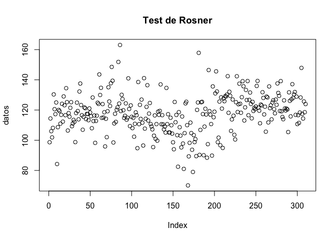

Resumen
=======

El documento que aquí se presenta se corresponde con el informe
resultante del trabajo de detección de anomalías, para la asignatura
Minería de Datos: Aprendizaje no supervizado y detección de anomalías.
Este trabajo se ha llevado a cabo sobre el conjunto de datos *Vertebral
Column*, obtenido del archivo de la Universidad de California en Irvine
(UCI). En este trabajo se han utilizado diversas técnicas para la
detección de outliers o valores anómalos, se correspondan a una variable
concreta (univariantes) o por la combinación de diversas variables
(multivariantes).

Ajuste del entorno
==================

A continuación se lleva a cabo la carga de los scripts necesarios para
la detección de anomalías en la forma que las directrices de la
asignatura lo requieren

    source("!Outliers_A2_Librerias_a_cargar_en_cada_sesion.R")
    source("!Outliers_A3_Funciones_a_cargar_en_cada_sesion.R")

Dataset escogido: Vertebral Column Data Set
-------------------------------------------

Conjunto de datos que contiene valores para seis características
biomecánicas utilizadas para clasificar a los pacientes ortopédicos en 3
clases (normal, hernia de disco o espondilolistesis) o 2 clases (normal
o anormal).

### Carga de datos

Los datos se han obtenido del archivo de la Universidad de California en
Irvine (UCI), que posee una gran cantidad de conjuntos de datos de libre
acceso, donados por particulares profesionales y/o empresas.

    temp <- tempfile()
    download.file("https://archive.ics.uci.edu/ml/machine-learning-databases/00212/vertebral_column_data.zip",temp)
    dataset <- read.table(unz(temp, "column_3C.dat"))
    names(dataset) <- c("InciPel", "InclPel", "AngLor", "PenSac", "RadPel", "GraEsp", "Clase")
    rm(temp)

Cada paciente está representado en el conjunto de datos mediante seis
atributos biomecánicos derivados de la forma y orientación de la pelvis
y la columna lumbar (en este orden):

1.  Incidencia pélvica **(InciPel)**
2.  Inclinación de la pelvis **(InclPel)**
3.  Ángulo de lordosis lumbar **(AngLor)**
4.  Pendiente sacra **(PenSac)**
5.  Radio de la pelvis **(RadPel)**
6.  Grado de espondilolistesis **(GraEsp)**
7.  Clase: Hernia de disco **(DH)**, Espondilolistesis **(SL)**, Normal
    **(NO)** y Anormal **(AB)**

Outliers univariados en la variable de la Incidencia pélvica (InciPel)
======================================================================

A continuación, en esta parte del documento se expone el procedimiento
para llevar a cabo la detección heurística de Outliers en 1 variable
según el método IQR.

    mydata.numeric  = dataset[,-ncol(dataset)] #Sin clase
    indice.columna  = 1
    nombre.mydata   = "Vertebral DataSet"

    mydata.numeric.scaled <- scale(mydata.numeric)
    columna <- mydata.numeric[,indice.columna]
    nombre.columna <- names(mydata.numeric)[indice.columna]
    columna.scaled <- mydata.numeric.scaled[,indice.columna]

Cálculo de vector booleano de outliers normales y extremos
----------------------------------------------------------

A continuación, se calculan las fronteras a partir de las cuales una
observación se convierte en outlier, pudiendo ser considerado normal y
extremo. Para ello será necesario en primer lugar, calcular la distancia
inter-cuartil (IQR). Outliers normales serán aquellos que excendan en
1.5 IQR el primer o tercer cuartil, por abajo y por arriba
respectivamente, y outliers extremos los que lo hagan en 3 IQR.

    # Cálculo de la distancia inter-cuartil
    cuartil.primero <- unname(quantile(columna,0.25))
    cuartil.tercero <- unname(quantile(columna,0.75))
    iqr <- cuartil.tercero - cuartil.primero
    # Cálculo de los outliers normales
    extremo.superior.outlier.normal <- cuartil.tercero + 1.5 * iqr
    extremo.inferior.outlier.normal <- cuartil.primero - 1.5 * iqr
    # Cálculo outliers extremos
    extremo.superior.outlier.extremo <- cuartil.tercero + 3 * iqr
    extremo.inferior.outlier.extremo <- cuartil.primero - 3 * iqr
    print("Límites para outliers normales")

    ## [1] "Límites para outliers normales"

    c(extremo.superior.outlier.normal, extremo.inferior.outlier.normal)

    ## [1] 112.55125   6.76125

    print("Límites para outliers extremos")

    ## [1] "Límites para outliers extremos"

    c(extremo.superior.outlier.extremo, extremo.inferior.outlier.extremo)

    ## [1] 152.2225 -32.9100

    # Vector booleano de outliers normales
    vector.es.outlier.normal <- columna > extremo.superior.outlier.normal | 
        columna < extremo.inferior.outlier.normal
    # Vector booleano de outliers extremos
    vector.es.outlier.extremo <- columna > extremo.superior.outlier.extremo | 
        columna < extremo.inferior.outlier.extremo

    table(vector.es.outlier.normal)

    ## vector.es.outlier.normal
    ## FALSE  TRUE 
    ##   307     3

    table(vector.es.outlier.extremo)

    ## vector.es.outlier.extremo
    ## FALSE 
    ##   310

Tal y como se puede observar, los límites establecidos para outliers
normal son mas restrictivos, pues estos valores si bien atípicos, son
más cercanos a la distribución del resto de valores de la variable.

A su vez, podemos observar como hay **tres outliers normales** y **no
hay outliers extremos**.

Índices y valores de los outliers identificados
-----------------------------------------------

A continuación, una vez que en el paso anterior se han identificado los
outliers normales y extremos, se lleva a cabo la obtención del índice
correspondiente a tal observación y su respectivo valor:

    # Obtención del id de fila de los outliers normales y extremos
    claves.outliers.normales <- which(vector.es.outlier.normal)
    claves.outliers.extremos <- which(vector.es.outlier.extremo)
    # Obtención de las filas completas de los outliers normales y extremos
    data.frame.outliers.normales <- as.data.frame(mydata.numeric.scaled)[claves.outliers.normales,]
    data.frame.outliers.extremos <- as.data.frame(mydata.numeric.scaled)[claves.outliers.extremos,]
    # ID de la fila de los outliers normales y extemos
    nombres.outliers.normales <- rownames(data.frame.outliers.normales)
    nombres.outliers.extremos <- rownames(data.frame.outliers.extremos)
    # Obtención del valor de los outlier normales y extremos solo para la columna analizada
    valores.outliers.normales <- data.frame.outliers.normales[,indice.columna]
    valores.outliers.extremos <- data.frame.outliers.extremos[,indice.columna]

    data.frame.outliers.normales

    ##      InciPel    InclPel      AngLor   PenSac     RadPel    GraEsp
    ## 116 4.022574 -0.9135467 -0.19137407 5.846502 -0.7681959 10.443422
    ## 163 3.344346  2.0890092 -0.05878643 2.737601 -2.7708046  1.271158
    ## 164 3.215547  1.9960849  1.34039044 2.641496 -0.9927103  1.461792

En la salida anterior se puede observar las observaciones que resultan
outliers para la variable incidencia pélvica, siendo estas outliers
normales, pues como hemos visto anteriormente, no hay outliers extremos
para esta variable concreta.

Desviación de los outliers con respecto a la media de la columna
----------------------------------------------------------------

A continuación se obtienen los valores normalizados (con respecto a la
media del propio atributo analizado) de los outliers de la columna en
cuestión.

    valores.normalizados.outliers.normales <- columna.scaled[vector.es.outlier.normal]
    valores.normalizados.outliers.normales

    ## [1] 4.022574 3.344346 3.215547

Tal y como se puede apreciar, esta z-score obtenida es muy elevada, lo
que hace que se encuentre muy alejada de la media de la distribución de
la variable y que hace pensar que confirma la existencia de estos tres
outliers.

Gráfico de puntos
-----------------

A continuación se representan los distintos valores que las
observaciones toman de la variable de estudio y en rojo se representan
aquellas que tienen valores atípicos.

    # Gráfico outliers normales
    MiPlot_Univariate_Outliers(columna.scaled, 
                               claves.outliers.normales,
                               colnames(mydata.numeric)[indice.columna])

    # Gráfico outliers extremos
    MiPlot_Univariate_Outliers(columna.scaled, 
                               claves.outliers.extremos,
                               colnames(mydata.numeric)[indice.columna])

Podemos observar como en el gráfico de los outliers normales quedan
representados aquellos puntos en rojo que se corresponden a los tres
outliers identificados y como en el gráfico de outliers extremos no hay
ninguno, verificando lo anteriormente ya sabido.

BoxPlot
-------

En un boxplot a continuación también se representan los distintos
valores de la variable de estudio, remarcando dentro de la distribución
de valores, donde se encuentran los valores atípicos. En otro boxplot se
muestra la misma variable con sus datos normalizados, para demostrar que
la distribución no varía tras llevar a cabo la normalización.

    # Boxplot variable con outliers remarcados
    MiBoxPlot_IQR_Univariate_Outliers(mydata.numeric, indice.columna, coef = 1.5)

    # Boxplot variable con outliers remarcados y normalizado
    MiBoxPlot_IQR_Univariate_Outliers(mydata.numeric.scaled, indice.columna)

Tal y como se puede observar, ambos boxplot muestran una misma
distribución dentro de los valores de la variable de estudio, estando
diferenciandos solo en la escala en la que se miden. También se aprecian
los tres puntos por encima de la caja, correspondientes a los outliers
anteriormente descubiertos.

Realización del análisis con funciones propias
----------------------------------------------

A continuación, se llevará a cabo el mismo análisis efectuado pero
haciendo uso de las funciones provistas por el equipo docente de la
asignatura.

### Cálculo de vector booleano de outliers

A continuación se utiliza una función provista en el fichero
*!Outliers\_A3\_Funciones\_a\_ cargar\_en\_cada\_sesion.R* para llevar a
cabo el cálculo de un vector de booleanos que determine si un
determinado elemento de una variable concreta supera en un cierto umbral
*coef* el primero o tercer cuartil, a fin de que sea o no considerado un
outlier:

    vector_claves_outlier_IQR <- vector_es_outlier_IQR(mydata.numeric.scaled, 
                                                        indice.columna, 
                                                        coef = 1.5)
    table(vector_claves_outlier_IQR)

    ## vector_claves_outlier_IQR
    ## FALSE  TRUE 
    ##   307     3

Tal y como vemos, **se obtienen los tres outliers normales** que
habiamos descubierto anteriormente haciendo el mismo procedimiento de
forma manual.

### BoxPlot para todas las variables

En este epígrafe se muestra una representación conjunta de boxplot para
cada una de las variables del conjunto de datos normalizadas, marcando
en rojo aquello puntos que son outliers de cualquier tipo (normales y
extremos). A su vez, se muestra otro gráfico similar con los valores
etiquetados.

    # Boxplot con outliers remarcados
    MiBoxPlot_juntos(mydata.numeric)

    # Boxplot con outliers remarcados y etiquetados
    MiBoxPlot_juntos_con_etiquetas(mydata.numeric.scaled)

Se puede apreciar como el radio de la pelvis parece que es la variable
en la que hay más valores atípicos, seguido de la inclinación de la
pelvis y del grado de espondilolistesis.

Ampliación
----------

A continuación se lleva a cabo la parte del análisis reservada para
aquellos que llevaron a cabo el trabajo de detección de anomalías frente
al de reglas de asociación.

### Cálculo de outliers en alguna de las columnas

A continuación se itera sobre todas las columnas por medio de la función
sapply, a fin de detectar todas aquellas observaciones que tienen
valores atípicos en cualquiera de sus columnas.

    indices.de.outliers.en.alguna.columna <- 
        unique(unlist(sapply(1:ncol(mydata.numeric),
                      function(x){
                          vector_claves_outliers_IQR(mydata.numeric, x)
                          })))
    indices.de.outliers.en.alguna.columna

    ##  [1] 116 163 164  52  66  76  85 113 123 137 142 146 180 192 203 207 198
    ## [18]  10  84  86 156 168 174 181 191 305  72  77  96 144 193

El listado de IDs de filas de las observaciones que tienen resultan
outlier para alguna de sus variables es el arriba mostrado.

### Valores de los outliers identificados para alguna de las columnas

A continuación se muestran de forma íntegra algunas de las observaciones
cuyos valores de variables resultan en al menos un caso outliers. Todos
los datos se encuentran previamente normalizados.

    head(mydata.numeric.scaled[indices.de.outliers.en.alguna.columna, ])

    ##        InciPel    InclPel      AngLor      PenSac     RadPel       GraEsp
    ## [1,] 4.0225735 -0.9135467 -0.19137407  5.84650238 -0.7681959 10.443421801
    ## [2,] 3.3443462  2.0890092 -0.05878643  2.73760102 -2.7708046  1.271157558
    ## [3,] 3.2155469  1.9960849  1.34039044  2.64149551 -0.9927103  1.461791555
    ## [4,] 0.8083910  2.3997563 -1.30597259 -0.75050734 -0.7486729 -0.567022771
    ## [5,] 1.3595595  2.3727782  0.54270871 -0.02263851 -0.2185485  0.007807955
    ## [6,] 0.5641364  2.2258978  0.87256089 -0.93526831  2.2984159  3.170575065

Esta salida es una muestra, pues el número total de outliers
univariantes es bastante superior a los aquí mostrados. En cualquier
caso, vemos como para los ejemplos presentes, su z-score es bastante
elevado en alguna de sus variables.

### Función para cálculo automático de índices de outliers univariantes

Del mismo modo que se han calculado anteriormente los índices de
aquellas observaciones que resultan outliers en alguna de sus variables
(outliers univariantes), se lleva a cabo el mismo cálculo generando una
función que se muestra a continuación.

    vector_claves_outliers_IQR_en_alguna_columna <- function(datos, coef = 1.5){
        unique(unlist(sapply(1:ncol(mydata.numeric),
                      function(x){
                          vector_claves_outliers_IQR(mydata.numeric,
                                                     x, 
                                                     coef = coef)
                          })))
    }

    vector_claves_outliers_IQR_en_alguna_columna(mydata.numeric)

    ##  [1] 116 163 164  52  66  76  85 113 123 137 142 146 180 192 203 207 198
    ## [18]  10  84  86 156 168 174 181 191 305  72  77  96 144 193

Como podemos observar el valor es similar al anteriormente obtenido en
el cálculo manual, pues sigue el mismo procedimiento, si bien se ha
encapsulado en una nueva función que podrá ser utilizada en cualquier
otra situación que se requiera.

Outliers univariados mediante test estadísticos
===============================================

Este epígrafe del trabajo se corresponde a la determinación de la
existencia de outliers univariados por medio del uso de test
estadísticos.

Un único outlier
----------------

A continuación se analiza la circunstancia de cuando existe un único
outlier en los datos a analizar. Para ello la variable a analizar será
la pendiente sacra (PenSac), pues graficamente podemos intuir que en
ella hay un outlier:

    mydata.numeric  = dataset[,-ncol(dataset)] 
    # Selección de la variable
    mydata.numeric <- mydata.numeric$PenSac
    # Histograma de la variable
    hist(mydata.numeric)

    # Gráfico de puntos de la variable
    plot(mydata.numeric)

Efectivamente, en esta variable solo hay un valor que se salga
claramente de la distribución habitual de la misma.

### Test de Grubbs

El test que se lleva a cabo a continuación plantea en su hipótesis
alternativa la existencia de un único outlier. Así, se aplica sobre la
variable anterior a ver si nuestra suposición de la existencia de ese
outlier es cierta:

    # Cálculo del test de Grubbs
    test.de.Grubbs <- grubbs.test(mydata.numeric, two.sided = TRUE)
    # Extracción del p-value del test te Grubbs
    test.de.Grubbs$p.value

    ## [1] 5.597568e-07

El test de Grubbs es significativo, por lo que consideramos la
**existencia de un outlier en la variable PenSac**.

### Índice y valor del outlier

Obtenemos el índice de la fila de la observación que es outlier en la
variable PenSac y obtenemos su valor:

    # Obtención del índice del valor atípico según Grubbs
    indice.de.outlier.Grubbs <- order(abs(mydata.numeric - mean(mydata.numeric)), 
                                      decreasing = TRUE)[1]
    # Obtención del valor atípico según Grubbs
    valor.de.outlier.Grubbs <- mydata.numeric[indice.de.outlier.Grubbs]
    paste("Observación",indice.de.outlier.Grubbs,"con valor:", valor.de.outlier.Grubbs)

    ## [1] "Observación 116 con valor: 121.43"

Tal y como se muestra en la salida, **el outlier para PenSac es la
observación 116 y tiene de valor 121.43.**

### Gráfico de puntos

A continuación, se representan los distintos valores que las
observaciones toman de la variable PenSac y en rojo se representa
aquella observación que Grubbs ha determinado como outlier.

    MiPlot_Univariate_Outliers(mydata.numeric, indice.de.outlier.Grubbs, "Outliers")

Efectivamente, el sentido común se ha confirmado en este caso y la
variable PenSac tiene un outlier que se remarca en rojo en el gráfico
anterior.

Ampliación
----------

A continuación, se lleva a cabo la parte del análisis reservada para
aquellos que llevaron a cabo el trabajo de detección de anomalías frente
al de reglas de asociación.

### Función que engloba el análisis anterior de un outlier (Grubbs)

A continuación se utiliza una función provista en el fichero
*!Outliers\_A3\_Funciones\_a\_ cargar\_en\_cada\_sesion.R* para llevar a
cabo el mismo análisis realizado anteriormente mendiante el test de
Grubbs y el gráfico que pone de manifiesto la existencia del outlier:

    MiPlot_resultados_TestGrubbs(mydata.numeric)

    ## p.value: 5.597568e-07
    ## ?ndice de outlier: 116
    ## Valor del outlier: 121.43

Efectivamente, la salida es la misma, y el test de Grubbs es nuevamente
significativo y el gráfico muestra dicho outlier.

### Masking en el test de Grubbs

Sobre una variable que aparentemente tiene más de un outlier (InciPel),
se evalúa el test de Grubbs a fin de ver si funciona o por el contrario,
la existencia de más de un outlier enmascara (masking) la presencia de
solo uno de ellos (hipótesis alternativa del test).

    mydata.numeric  = dataset[,-ncol(dataset)] 
    # Selección de la variable
    mydata.numeric <- mydata.numeric$RadPel
    # Gráfica de puntos de la variable RadPel
    plot(mydata.numeric)

    # Test de Grubbs para la variable RadPel
    test.de.Grubbs = grubbs.test(mydata.numeric, two.sided = TRUE)
    test.de.Grubbs$p.value

    ## [1] 0.08860458

    # Gráfica de puntos de RadPel con los outliers remarcados
    MiPlot_resultados_TestGrubbs(mydata.numeric)

    ## p.value: 0.08860458
    ## No hay outliers

Efectivamente, frente a esta variable con más de un outlier no se puede
rechazar la hipótesis nula, por lo que **la presencia de varios outliers
enmascara la realidad**.

### Test de Rosner con más de un outlier

Para solventar el problema del masking, existe el test de Rosner, el
cual tiene por hipótesis alternativa la presencia de menos de k
outliers, frente a la hipótesis nula de la inexistencia de outliers.
Para comprobar la utilidad de este test se utiliza la variable
Incidencia pélvica **(InciPel)**, que anteriormente ha demostrado que
tiene tres outliers:

    mydata.numeric  = dataset[,-ncol(dataset)] 
    # Selección de la variable
    mydata.numeric <- mydata.numeric$InciPel
    # Test de Rosner para menos de 4 outliers
    test.de.rosner <- rosnerTest(mydata.numeric, k=4)
    # Vector de booleans de outliers
    test.de.rosner$all.stats$Outlier

    ## [1]  TRUE FALSE FALSE FALSE

    # Índices de los elementos analizados por el test
    test.de.rosner$all.stats$Obs.Num

    ## [1] 116 163 164  97

    # Índices de los outliers obtenidos
    indices_de.outliers_rosner <- test.de.rosner$all.stats$Obs.Num[test.de.rosner$all.stats$Outlier]
    # Gráfica de los outliers
    MiPlot_Univariate_Outliers (mydata.numeric, indices_de.outliers_rosner, "Test de Rosner")

Según el análisis realizado por medio de la IQR en la primera parte de
este documento, la variable Incidencia pélvica tiene tres outliers. Sin
embargo, una vez realizado el test de Rosner para menos de cuatro
outliers, da como resultado que solo uno de ellos lo es y así se muestra
en la gráfica de puntos.

### Test de Rosner para más de un outlier mediante función provista en clase

Se lleva a cabo el mismo análisis realizado en el punto anterior sobre
la variable Incidencia pélvica **(InciPel)**, pero por medio de una
función provista en el fichero *!Outliers\_A3\_Funciones\_
a\_cargar\_en\_cada\_sesion.R*, que realiza tanto el test, como la
gráfica automáticamente:

    MiPlot_resultados_TestRosner(mydata.numeric)

    ## 
    ## Test de Rosner
    ## ?ndices de las k-mayores desviaciones de la media: 116 163 164 97
    ## De las k mayores desviaciones, ?Qui?n es outlier? TRUE FALSE FALSE FALSE
    ## Los ?ndices de los outliers son: 116
    ## Los valores de los outliers son: 129.83

Al igual que en punto anterior, podemos observar como el test de Rosner
para menos de cuatro outliers, nos indica que solo uno de ellos lo es
realmente y nuevamente, así se muestra en el gráfico que la función
anterior tambíen dibuja.

### Test de Rosner para un outlier mediante función provista en clase

Se realizará el mismo experimento con la función
*MiPlot\_resultados\_TestRosner* provista en
*!Outliers\_A3\_Funciones\_a\_ cargar\_en\_cada\_sesion.R*, pero ahora
para una variable que con certeza sabemos que tiene un único outlier,
Pendiente sacra **(PenSac)**.

    mydata.numeric  = dataset[,-ncol(dataset)] 
    # Selección de la variable
    mydata.numeric <- mydata.numeric$PenSac
    # Función para el test de Rosner y plotting
    MiPlot_resultados_TestRosner(mydata.numeric)

    ## 
    ## Test de Rosner
    ## ?ndices de las k-mayores desviaciones de la media: 116 163 95 164
    ## De las k mayores desviaciones, ?Qui?n es outlier? TRUE FALSE FALSE FALSE
    ## Los ?ndices de los outliers son: 116
    ## Los valores de los outliers son: 121.43

Siguiendo el sentido común, este test verifica la existencia de un
outlier, pues no podemos aceptar la hipótesis nula, en favor de la
alternativa, que dice que hay menos de k = 4 outliers. Esto lo podemos
apreciar en la gráfica dibujada por la función provista en el fichero de
funciones.

### Test de Rosner para más de un outlier mediante función provista en clase

Se realizará el mismo experimento con la función
*MiPlot\_resultados\_TestRosner*, pero para una variable que a priori
tiene varios outliers, como es Radio de la pelvis **(RadPel)**.

    mydata.numeric  = dataset[,-ncol(dataset)] 
    # Selección de la variable
    mydata.numeric <- mydata.numeric$RadPel
    # Función para el test de Rosner y plotting
    MiPlot_resultados_TestRosner(mydata.numeric)

    ## 
    ## Test de Rosner
    ## ?ndices de las k-mayores desviaciones de la media: 168 86 181 174
    ## De las k mayores desviaciones, ?Qui?n es outlier? FALSE FALSE FALSE FALSE
    ## Los ?ndices de los outliers son: 
    ## Los valores de los outliers son:

En este caso, el test de Rosner ha determinado que no hay outliers para
esta variable, en contra de lo hallado mediante la IQR.

Outliers multivariados por medio de Mahalanobis
===============================================

Un registro será un outlier porque tenga un valor anómalo en alguna
variable o porque tenga una combinación anómala de valores. En este
epígrafe se llevará a cabo la determinación de los outliers con respecto
a un conjunto de variables y mediante la distancia de Mahalanobis.

Outliers multivariados
----------------------

Con la función uni.plot, calculamos los outliers multivariados presenten
en nuestro conjunto de datos considerando la estimación robusta de la
matriz de covarianzas (MCD) y la estimación robusta de la media de cada
variable. Además imprime un plot unidimensional donde se aprecian los
outliers para todas las variables.

    mydata.numeric <- dataset[,-ncol(dataset)] 
    mydata.numeric.scaled = scale(mydata.numeric, center = TRUE)
    set.seed(52)
    mvoutlier.plot <- uni.plot(mydata.numeric, symb = FALSE, alpha = 0.05, quan = 0.8)

Tal y como se puede apreciar, solo se detecta la existencia de dos
outlier multivariados, estando estos representados en los dos puntos
rojos en cada una de las variables del gráfico anterior.

Información de los outliers multivariados
-----------------------------------------

A continuación, se calcula tanto un vector de boolean que determina si
cada entrada del conjunto de datos es o no un outlier multivariado, como
el índice de dichos outliers y el número de ellos que hay.

    # Vector de booleans de si son o no outliers mutlivariados
    is.MCD.outlier <-  mvoutlier.plot$outliers
    # Número de outliers
    numero.de.outliers.MCD <- sum(is.MCD.outlier)
    # Índice de los outliers
    indices.de.outliers.multivariantes.MCD <- which(mvoutlier.plot$outliers)
    cat("Hay", numero.de.outliers.MCD, 
        "outliers multivariados, cuyos índices son:", 
        indices.de.outliers.multivariantes.MCD)

    ## Hay 39 outliers multivariados, cuyos índices son: 10 52 61 62 72 73 76 77 83 84 85 86 96 105 108 113 115 116 118 123 125 135 142 144 163 164 168 174 180 181 184 193 198 202 203 206 207 225 253

Tal y como se puede apreciar, se han encontrado 39 outliers
multivariantes, siguiendo la primera impresión que tuvimos con el
gráfico de la función anterior. Estos outliers tienen el ID de fila
arriba mostrado.

Desviación de la media de los outliers multivariados
----------------------------------------------------

Determinamos en un dataframe el valor normalizado de los outliers
multivariados, de forma que podemos apreciar cuando se desvían estos de
la media de la variable.

    data.frame.solo.outliers <- mydata.numeric.scaled[is.MCD.outlier,]
    head(data.frame.solo.outliers)

    ##         InciPel   InclPel     AngLor      PenSac     RadPel     GraEsp
    ## [1,] -1.3811983 -1.252271 -0.5379344 -0.83990781 -2.5290198 -0.6825747
    ## [2,]  0.8083910  2.399756 -1.3059726 -0.75050734 -0.7486729 -0.5670228
    ## [3,]  0.8054902  1.449530  1.4465683 -0.04722364  1.9252264  0.7943063
    ## [4,]  1.6931615  1.514477  1.6815611  1.04495211  0.9040236  1.7501388
    ## [5,]  1.5318722  1.537458 -0.2231735  0.82070593  1.2884764  2.0081337
    ## [6,]  1.4198980  1.546451  0.4812657  0.67021514  0.5811433  1.2788788

Parece que se puede intuir que por la alta z-score que estas
observaciones tienen, en al menos una de sus variables, les hacen
candidatos a ser outliers univariados y por tanto, multivariados, habrá
que hacer un análisis en mayor profundidad para determinar los outliers
multivariados puros.

Boxplot con los outliers multivariados identificados
----------------------------------------------------

A continuación, se muestra un boxplot para cada una de las variables,
con todos los outliers identificados y etiquetados con su ID de fila:

    MiBoxPlot_juntos(mydata.numeric.scaled,is.MCD.outlier)

Se aprecia como los outliers multivariados son efecto de que en alguna
de sus variables tienen un valor que difiere en gran medida de la
distribución de las mismas, siendo por tanto outliers univariados
también.

BiPlot con PCA y outliers multivariados
---------------------------------------

A continuación, por medio de la función
*MiBiPlot\_Multivariate\_Outliers* del fichero
*!Outliers\_A3\_Funciones\_a\_ cargar\_en\_cada\_sesion.R*, se muestra
un BiPlot que nos muestra una representación aproximada de n dimensiones
a 2, representando en rojo los outliers multivariados existente.

Se puede apreciar que los outliers multivariados se encuentra alejados
de la nube de puntos principal, que se situa alrededor de la media de
los componentes, estando uno de ellos claramente alejado del resto.

Ampliación
----------

A continuación, se lleva a cabo la parte del análisis reservada para
aquellos que llevaron a cabo el trabajo de detección de anomalías frente
al de reglas de asociación.

### Outliers multivariados puros

A continuación, se obtienen aquellas observaciones, que no siendo
outliers univariados, lo son multivariados, por la combinación de los
valores de sus variables

    # Outliers univariantes
    indices.de.outliers.en.alguna.columna <- vector_claves_outliers_IQR_en_alguna_columna(mydata.numeric) 
    # Índices outliers multivariantes puros
    indices.de.outliers.multivariantes.MCD.pero.no.1variantes <-
        setdiff(indices.de.outliers.en.alguna.columna,
                indices.de.outliers.multivariantes.MCD)
    # Nombres outliers multivariantes puros
    nombres.de.outliers.multivariantes.MCD.pero.no.1variantes <-
        rownames(mydata.numeric)[indices.de.outliers.multivariantes.MCD.pero.no.1variantes]
    nombres.de.outliers.multivariantes.MCD.pero.no.1variantes

    ## [1] "66"  "137" "146" "192" "156" "191" "305"

Como se puede apreciar en la salida anterior, hay siete observaciones de
columnas que resultan outliers multivariantes no siendo univariantes
para ninguna de sus variables.

### Matriz de gráficos de dispersión

A fin de tener una mejor imagen de lo que sucede para la existencia de
outliers multivariados, generamos una matriz de gráficos de dispersión
que relacionan todas las variables de nuestro conjunto de datos, estando
en rojo marcadas aquellas observaciones que son outliers.

    MiPlot_Univariate_Outliers(mydata.numeric,
                               indices.de.outliers.multivariantes.MCD.pero.no.1variantes,
                               "Outliers multivariados por pares de variables")

Podemos observar como para algunas combinaciones de variables, algunas
observaciones se sitúan en el extremo de la nube de puntos, destacanto
la relación entre incidencia pélvica **(InciPel)** e inclinación de la
pelvis **(InclPel)** y el radio de la pelvis **(RadPel)**. Así pues,
parece que las características de la pelvis son las que tienen un efecto
mayor en la determinación de los valores anómalos multivariados en
nuestro conjunto de datos.

Outliers multivariados por medio de LOF
=======================================

En este epígrafe del trabajo se propone la determinación de outliers
multivariados por medio del método de LOF (local outlier factor). Este
es un algoritmo para encontrar puntos de datos anómalos mediante la
medición de la desviación local de un dato determinado con respecto a
sus vecinos. Como es un método basado en distancia habrá que normalizar
los datos previamente:

    mis.datos.numericos <- dataset[,-ncol(dataset)]
    mis.datos.numericos.normalizados <- as.data.frame(scale(mis.datos.numericos))

Limitaciones de la distancia de Mahalanobis
-------------------------------------------

En muchas ocasiones el método de Mahalanobis no es del todo aplicable,
dependiendo de las distribuciones de nuestras variables, que pueden
formar un otro grupo homogéneo distinto a la distribución habitual, que
son interpretados como outliers según Mahalanobis.

    set.seed(12)
    is.MCD.outlier <- uni.plot(mis.datos.numericos, symb = FALSE, alpha = 0.05, quan = 0.8)

    numero.de.outliers.MCD <- which(is.MCD.outlier$outliers)

Podemos apreciar que hay observaciones que parecen tener variables que
aun con valores similares, son consideradas outliers, cuando pueden ser
otro grupo dentro de nuestros datos.

    corr.plot(mis.datos.numericos[,1], mis.datos.numericos[,6]) 

    ## $cor.cla
    ## [1] 0.6387325
    ## 
    ## $cor.rob
    ## [1] 0.264261

En el gráfico de dispersión anterior vemos como ante combinaciones entre
la variable Incidencia pélvica **(InciPel)** y Grado de
espondilolistesis **(GraEsp)**, hay una gran cantidad de observaciones
con características similares que se enccuentran fuera del elipsoide
rojo, cuando a lo mejor no deberían ser outliers.

    MiBiplot(mis.datos.numericos)

En la representación que el Biplot anterior hace de todas las
dimensiones proyectadas en 2, apreciamos como arriba a la izquierda de
la nube de puntos principal, hay otra que puede corresponderse al otro
grupo del que hemos hablado anteriormente.

Outliers basados en distancia (LOF)
-----------------------------------

La distancia LOF se calcula como el factor entre la distancia de un
punto hacia sus vecinos y la densidad entre ellos, por ello, al ser un
método basado en vecinos, es imprescindible en primer lugar determinar
el número de vecinos a tener en cuenta:

    # Número de vecinos para el cálculo del LOF score
    numero.de.vecinos.lof <- 5
    # Obtención de la LOF score de las observaciones
    lof.scores <- lofactor(mis.datos.numericos.normalizados, k = numero.de.vecinos.lof)
    # Gráfico de puntos del valor de LOF score para cada observación
    plot(lof.scores)

En el gráfico superior vemos las distintas puntuaciones de LOF que
tienen las observaciones de nuestro conjunto de datos. Así, seremos
nosotros los que debamos establecer que número de ellas deben ser
determinadas outliers:

    # Número de outliers presentes (Aquellos n con mayor LOF score)
    numero.de.outliers <- 20
    # Observaciones ordenadas por LOF score
    indices.de.lof.outliers.ordenados <- order(lof.scores, decreasing = TRUE)
    # Top n observaciones de mayor LOF score
    indices.de.lof.top.outliers <- indices.de.lof.outliers.ordenados[1:numero.de.outliers]
    # Vector boolean de si es outlier
    is.lof.outlier <- row.names(mis.datos.numericos.normalizados) %in% indices.de.lof.top.outliers
    # Biplot PCA con outliers obtenidos mediante LOF-score etiquetados
    MiBiPlot_Multivariate_Outliers(mis.datos.numericos, is.lof.outlier, "Biplot de los outliers")

Tal y como se puede apreciar, los outliers determinados por el algoritmo
LOF son aquellas observaciones se encuentran alejados del resto, bien
por que se encuentran alejadas de todos los puntos, o porque están en
medio de nubes de puntos que pueden corresponderse a grupos homogéneos.

Ampliación
----------

A continuación, se lleva a cabo la parte del análisis reservada para
aquellos que llevaron a cabo el trabajo de detección de anomalías frente
al de reglas de asociación.

### Outliers multivariantes LOF pero no univarianes IQR

Para ver la diferencia entre dos de los distintos métodos que hasta
ahora hemos presentado, vamos a comprobar empíricamente como hay
diferencias ente la obtención de outliers por la LOF score y la IQR:

    # Indices outliers univariantes
    vector.claves.outliers.IQR.en.alguna.columna <- 
        vector_claves_outliers_IQR_en_alguna_columna(mydata.numeric)
    # Vector de boolean de outliers univariantes
    vector.es.outlier.IQR.en.alguna.columna <- 
        vector_es_outlier_IQR_en_alguna_columna(mydata.numeric)
    # Biplot PCA con outliers univariantes obtenidos por la IQR etiquetados
    MiBiPlot_Multivariate_Outliers(mydata.numeric, 
                                   vector.es.outlier.IQR.en.alguna.columna, "Biplot de los outliers")

    # Outliers multivariantes LOF pero no univariantes IQR
    indices.de.outliers.multivariantes.LOF.pero.no.1variantes <-
        setdiff(indices.de.lof.top.outliers, 
                vector.claves.outliers.IQR.en.alguna.columna)

Como se puede apreciar en el gráfico anterior, los outliers determinados
por medio de la IQR son aquellos que se encuentran alejados de la nube
de puntos principal, donde se encuentran las observaciones de valores
similares a las medias de las variables. Vemos como a diferencia de la
determinación de outliers por medio de la LOF score, se consideran
algunos que hemos visto que pueden ser debidas a la existencia de otros
grupos con distinta distribución dentro de los mismos datos.

    # Outliers multivariantes LOF
    indices.de.lof.top.outliers

    ##  [1] 116  52 181 198  86 164 163 144  96 216  54 258  28 135  38 168  41
    ## [18]  65 305 253

    # Outliers multivariantes LOF pero no univariantes IQR
    indices.de.outliers.multivariantes.LOF.pero.no.1variantes

    ## [1] 216  54 258  28 135  38  41  65 253

Así, se puede apreciar en la salida anterior, que muchos de los outliers
multivariantes determinados por medio de la LOF-score, no son
univariantes calculados por medio de IQR.

Outliers multivariados por medio de clustering
==============================================

En este epígrafe del trabajo se lleva a cabo el cómputo de los outliers
según la distancia euclídea de cada dato al centroide de su cluster. El
centroide podrá ser cualquiera (podrá provenir de un k-means o ser un
medoide, por ejemplo). Como los algoritmos de clustering se basan en
distancias, ha de normalizar nuestro conjunto de datos:

    mis.datos.numericos <- dataset[,-ncol(dataset)]
    mis.datos.numericos.normalizados <- scale(mis.datos.numericos)
    rownames(mis.datos.numericos.normalizados) <- rownames(mis.datos.numericos)

A su vez, determinamos el número de outliers a hallar y el número de
clusters existentes en los datos. De acuerdo a los expertos en el
dominio de nuestro conjunto de datos (expertos en la columna vertebral
humana), hay 3 tipos de columnas atendiendo a las características de las
mismas aquí consideradas:

-   Columna con hernia de disco
-   Columna con espondilolistesis
-   Columna normal

Así, se elegiran como número de clusters, tres y como número de outliers
a analizar, diez:

    numero.de.outliers <- 10
    numero.de.clusters <- 3

k-Means para la detección de outliers
-------------------------------------

Así pues, en un primer lugar, para la determinación de los clusters se
lleva a cabo un k-means. Establecemos la semilla para que este análisis
sea reproducible:

    # Semilla para primera iteración del k-means
    set.seed(2)
    # Función k-means para número de clusters determinado
    modelo.kmeans <- kmeans(mis.datos.numericos.normalizados, centers = numero.de.clusters)
    # Índice de las observaciones asociadas a cada cluster
    indices.clustering <- modelo.kmeans$cluster
    # Centroides calculados tras k-means
    centroides.normalizados <- modelo.kmeans$centers

    head(indices.clustering, 20)

    ##  1  2  3  4  5  6  7  8  9 10 11 12 13 14 15 16 17 18 19 20 
    ##  1  2  1  1  2  2  2  2  2  2  2  2  2  2  2  2  1  2  2  2

    centroides.normalizados

    ##      InciPel    InclPel     AngLor     PenSac     RadPel     GraEsp
    ## 1  0.3614933 -0.1445893  0.3250729  0.5719850 -0.5962573 -0.0464895
    ## 2 -0.8589019 -0.4756460 -0.7992214 -0.7482457  0.3556098 -0.5697347
    ## 3  1.3097578  1.3259046  1.2384374  0.6932261  0.2356517  1.3674794

Así, hemos obtenido la etiqueta del cluster que le corresponde a cada
observación de nuestro conjunto de datos, así como las coordenadas de
los centroides según cada una de las dimensiones.

Distancia euclidea de las observaciones a los centroides
--------------------------------------------------------

La medida que determinará el grado en que una observación se aleja de su
centroide y que por lo tanto, es un valor atípico, es la distancia. Esta
puede estar calculada de formas distintas, siendo la euclídea una de las
más habituales y la que usaremos a continuación:

    # Cálculo de la distancia euclídea de cada observación a su centroide
    dist.centroides <- 
        distancias_a_centroides(datos.normalizados =
                                    mis.datos.numericos.normalizados,
                                indices.asignacion.clustering = 
                                    indices.clustering,
                                datos.centroides.normalizados = 
                                    centroides.normalizados)
    # Observaciones con mayor distancia euclídea a su centride
    top.outliers <- order(dist.centroides, decreasing = TRUE)[1:numero.de.outliers]

    head(dist.centroides, 10)

    ##         1         2         3         4         5         6         7 
    ## 1.7802979 1.0556987 1.1436035 1.4108417 1.3600621 1.0521720 0.6648263 
    ##         8         9        10 
    ## 0.7626647 0.4778490 3.0473650

    top.outliers

    ##  [1] 116 163 198  96  76  52 180 169  86 164

Así, en las salidas anteriores vemos como se ha calculado tanto la
distancia euclídea al centroide asignado para cada observación y a su
vez, tenemos el índice de aquellas diez que tienen la mayor.

### Implementación de una función para realizar el mismo experimento

A fin de facilitar una automatización del proceso de hallar la distancia
euclídea de las observaciones a su centroide y obtener las que más
tienen, se genera una función con el mismo cometido:

    # Función que devuelve la distancia euclídea e índices de los valores
    # más alejados de su centroide.
    top_clustering_outliers <- function(datos.normalizados, 
                                        indices.asignacion.clustering, 
                                        datos.centroides.normalizados,
                                        numero.de.outliers){
        dist.centroides <- 
            distancias_a_centroides(datos.normalizados = datos.normalizados,
                                    indices.asignacion.clustering = 
                                        indices.asignacion.clustering,
                                    datos.centroides.normalizados = 
                                        datos.centroides.normalizados)
        top.outliers <- order(dist.centroides, decreasing = TRUE)[1:numero.de.outliers]
        list("indices" = top.outliers, "distancias" = dist.centroides[top.outliers])
    }
    # Llamada a la función
    top.outliers.kmeans <- top_clustering_outliers(datos.normalizados =
                                                       mis.datos.numericos.normalizados,
                            indices.asignacion.clustering = indices.clustering,
                            datos.centroides.normalizados = centroides.normalizados,
                            numero.de.outliers = numero.de.outliers)

    top.outliers.kmeans$indices

    ##  [1] 116 163 198  96  76  52 180 169  86 164

    top.outliers.kmeans$distancias

    ##       116       163       198        96        76        52       180 
    ## 11.151483  4.430823  4.194019  3.773773  3.414374  3.372965  3.284088 
    ##       169        86       164 
    ##  3.144149  3.111193  3.066772

Se puede apreciar que los índices coinciden con los hallados de forma
manual anteriormente, así como las distancias parecen ser las mayores,
correspondientes a las observaciones susceptibles de ser outliers.

### BiPlot con PCA y outliers multivariados hallados por clustering

A continuación, se muestra una proyección de todas las variables sobre
dos dimensiones y los clusters generados, donde se encuentran también
etiquetados los outliers, que como podemos apreciar parecen ser los
valores con mayor distancia al centroide de su cluster:

    MiBiPlot_Clustering_Outliers(mis.datos.numericos, "K-Means Clustering Outliers")

Podemos apreciar en el biplot como la determinación de los tres clusters
se ajusta en buena medida a nuestros datos. Del mismo modo, la mayor
parte de outliers parecen corresponderse al tercer cluster.

Ampliación
----------

A continuación se lleva a cabo la parte del análisis reservada para
aquellos que llevaron a cabo el trabajo de detección de anomalías frente
al de reglas de asociación.

### Revertir normalización de los centroides

El valor de los centroides anteriormente determinado se hizo con los
datos escalados, hecho que repercute en que el valor de estos también lo
esté. Así, procedemos a revertir el proceso de la obtención del z-score:

    # Media de todos los atributos
    mis.datos.medias <- colMeans(mis.datos.numericos)
    # Desviación típica de todos los atributos
    mis.datos.desviaciones <- sapply(mis.datos.numericos, sd)
    # Despejar el valor real del cálculo del z-score
    mis.datos.desviaciones.por.centroides<-
        sweep(centroides.normalizados,
              mis.datos.desviaciones,FUN = "*",MARGIN = 2)
    centroides.valores<-
        sweep(mis.datos.desviaciones.por.centroides,
              mis.datos.medias,FUN="+",MARGIN=2)
    centroides.valores

    ##    InciPel  InclPel   AngLor   PenSac   RadPel    GraEsp
    ## 1 66.72722 16.09583 57.96204 50.63148 109.9798 24.550648
    ## 2 45.69236 12.78257 37.10214 32.91036 122.6564  4.898143
    ## 3 83.07161 30.81274 74.90839 52.25887 121.0589 77.657742

Como podemos apreciar, el valor de las coordenadas de los centroides ya
es el real y se ha logrado revertir el proceso de normalización.

### Cálculo de outliers con distancia de Mahalanobis al centroide

En vez de usar la distancia euclídea, podemos utilizar la de Mahalanobis
para medir la separación entre una observación y el centroide al que
está asignado. Así, definimos la función
*top\_clustering\_outliers\_distancia\_mahalanobis* para llevar a cabo
su cálculo y hallar aquellos *numero.de.outliers* elementos de con la
mayor.

    # Función para hallar distancia de Mahalanobis e índices de las observaciones
    # con mayor.
    top_clustering_outliers_distancia_mahalanobis = function(datos, 
                                                             indices.asignacion.clustering, 
                                                             numero.de.outliers){
        cluster.ids = unique(indices.asignacion.clustering)
        k           = length(cluster.ids)
        seleccion   = sapply(1:k, function(x) indices.asignacion.clustering == x)
        
        # Usando la estimaci?n robusta de la media y covarianza: (cov.rob del paquete MASS:
        lista.matriz.de.covarianzas   = lapply(1:k, function(x)
            cov.rob(mis.datos.numericos[seleccion[,x],])$cov)
        lista.vector.de.medias        = lapply(1:k, function(x)
            cov.rob(mis.datos.numericos[seleccion[,x],])$center)
        mah.distances   = lapply(1:k, 
                                 function(x) mahalanobis(mis.datos.numericos[seleccion[,x],], 
                                                         lista.vector.de.medias[[x]], 
                                                         lista.matriz.de.covarianzas[[x]]))  
        todos.juntos = unlist(mah.distances)
        todos.juntos.ordenados = names(todos.juntos[order(todos.juntos, decreasing=TRUE)])
        indices.top.mah.outliers = as.numeric(todos.juntos.ordenados[1:numero.de.outliers])
        
        list(distancias = mah.distances[indices.top.mah.outliers], indices =
                 indices.top.mah.outliers)
    }
    # Semilla para que el resultado sea replicable
    set.seed(12)
    top.clustering.outliers.mah <-
        top_clustering_outliers_distancia_mahalanobis(mis.datos.numericos[,-ncol(mis.datos.numericos)], 
                                                      indices.clustering, numero.de.outliers)

    top.clustering.outliers.mah$indices

    ##  [1] 116 158 181 121  88 152  74  86 155  10

Los valores arriba impresos se corresponden con las 10 observaciones con
mayor distancia de Mahalanobis al centroide del cluster que se les ha
asignado. Este resultado se puede mostrar gráficamente en un biplot,
proyección en dos dimensiones de los atributos de nuestro conjunto de
datos, con los outliers hallados etiquetados con su ID de fila:

    numero.de.datos <- nrow(mis.datos.numericos)
    is.kmeans.outlier.mah <- rep(FALSE, numero.de.datos) 
    is.kmeans.outlier.mah[top.clustering.outliers.mah$indices] = TRUE
    BIPLOT.isOutlier             = is.kmeans.outlier.mah
    BIPLOT.cluster.colors        = c("blue","red","brown")
    BIPLOT.asignaciones.clusters = indices.clustering

    MiBiPlot_Clustering_Outliers(mis.datos.numericos, "K-Means Clustering Outliers")

Efectivamente, tras ver el gráfico anterior, podemos estar casi seguros
de que los outliers determinados por medio de la distancia de
Mahalanobis son aquellos más alejados del centroide al cluster

### Cálculo de outliers con distancia de relativa al centroide

En vez de usar la distancia euclídea y de Mahalanobis, podemos utilizar
la relativa para medir la separación entre una observación y el
centroide al que está asignado. Así, definimos la función
*top\_clustering\_outliers\_distancia\_relativa* para llevar a cabo su
cálculo y hallar aquellos *numero.de.outliers* elementos de con la
mayor.

    # Función para hallar distancia relativa e índices de las observaciones
    # con mayor
    top_clustering_outliers_distancia_relativa = function(datos.normalizados, 
                                                          indices.asignacion.clustering, 
                                                          datos.centroides.normalizados, 
                                                          numero.de.outliers){
        
        dist_centroides = distancias_a_centroides (datos.normalizados, 
                                                   indices.asignacion.clustering, 
                                                   datos.centroides.normalizados)
        cluster.ids = unique(indices.asignacion.clustering)
        k           = length(cluster.ids)
        
        distancias.a.centroides.por.cluster = sapply(1:k , function(x) 
            dist_centroides [indices.asignacion.clustering  == cluster.ids[x]])
        distancias.medianas.de.cada.cluster = sapply(1:k , function(x)
            median(dist_centroides[[x]]))
        
        todas.las.distancias.medianas.de.cada.cluster  =
            distancias.medianas.de.cada.cluster[indices.asignacion.clustering]
        ratios = dist_centroides / todas.las.distancias.medianas.de.cada.cluster
        
        indices.top.outliers = order(ratios, decreasing=T)[1:numero.de.outliers]
        
        list(distancias = ratios[indices.top.outliers]  , indices = indices.top.outliers)
    }
    # Semilla para que el resultado sea replicable
    set.seed(12)
    top.outliers.kmeans.distancia.relativa <-
        top_clustering_outliers_distancia_relativa(mis.datos.numericos.normalizados,
                                                   indices.clustering,
                                                   centroides.normalizados,
                                                   numero.de.outliers)
    cat("Índices de los top k clustering outliers (k-means, usando distancia relativa)\n")

    ## Índices de los top k clustering outliers (k-means, usando distancia relativa)

    top.outliers.kmeans.distancia.relativa$indices 

    ##  [1] 116 163 198  96  76  86  10 180 181 169

    cat("Distancias a sus centroides de los top k clustering outliers (k-means, usando distancia relativa)\n")

    ## Distancias a sus centroides de los top k clustering outliers (k-means, usando distancia relativa)

    top.outliers.kmeans.distancia.relativa$distancias

    ##      116      163      198       96       76       86       10      180 
    ## 9.751179 3.874440 3.667372 3.299896 2.985627 2.947046 2.886586 2.871702 
    ##      181      169 
    ## 2.827160 2.749335

Los valores arriba impresos se corresponden con las 10 observaciones con
mayor distancia relativa al centroide del cluster que se les ha
asignado. También se muestra la distancia de cada una de esas
observaciones a su centroide.

Resumen de los resultados y conclusiones
========================================

Tras haber llevado a cabo este trabajo, podemos concluir varios aspectos
tanto del propio conjunto de datos objeto de análisis, como de la
metodología empleada para su realización.

En el conjunto de datos *Vertebral Column*, en terminos generales cabe
esperar que al incluir defectos vertebrales más o menos serios, casi con
totalidad encontraremos algún valor atípico. Así, una vez realizados los
distintos análisis propuestos en el material de la asignatura, se ha
podido comprobar que efectivamente hay ciertas observaciones que deben
tener la consideración de outliers.

En el análisis univariante por medio de IQR, hemos tratado
específicamente la variable incidencia pélvica **(InciPel)**, en la cual
hemos visto que tiene tres outliers normales y ninguno extremo. Para el
resto de variables, el número de outliers se sitúa entre uno y ocho,
habiendo dos extremos, uno en el grado de espondilolistesis **(GraEsp)**
y en la pendiente sacra **(PenSac)**.

Los test estadísticos para outliers univariantes (Grubbs y Rosner) han
confirmado la existencia de varios de los outliers hallados por la IQR,
si bien no todos, pues para algunos de los más cercanos a la mediana de
las variables no se ha rechazado la hipótesis nula de la no existencia
de esos outliers.

En cuanto a los outliers multivariantes, se han aplicado diversos
métodos para su identificación. En primer lugar con Mahalanobis a parte
de los univariantes, se han identificado seis multivariantes puros. De
forma gráfica se ha podido identificar que parece existir una relación
entre la incidencia pélvica **(InciPel)**, inclinación de la pelvis
**(InclPel)** y el radio de la pelvis **(RadPel)**, cuyos valores pueden
ayudar a que se den outliers multivariados. Sin embargo, también se han
observado ciertas limitaciones con la distancia de Mahalanobis, pues
ante variables con varias distribuciones por la existencia de distintos
grupos, tiende a considerar estas como outliers y no a los valores
intermedios que realmente lo sean.

Otro método que ha sido utilizado para outliers multivariantes ha sido
la LOF-score, que considera la desviación local de un dato con respecto
a sus vecinos. Este método soluciona las limitaciones de la distancia de
Mahalanobis y parece que los outliers detectados tienen bastante
sentido, si bien todo el análisis depende de la elección del número de
vecinos a elegir, por lo que no resulta tan intuitivo para el autor del
presente documento.

El último método para analizar outliers multivariantes ha sido el
clustering, hallando la distancia de las observaciones al centroide
asignado a estas. La distancia euclídea parece dar buenos resultados, si
bien cuando se ha utilizado la de Mahalanobis da la impresión que se
ajusta mejor a la distribución de los datos. Sin embargo, cabe recalcar
que este análsis tiene la limitación de que aunque se realiza para todas
las variables, luego se ha de tener que elegir la frontera donde se
establece si una observación es o no un outlier de forma manual.

En general, en cualquier problema en el que interviene un conjunto de
datos es imprescindible llevar a cabo un análisis de outliers dentro de
nuestro EDA para entender mejor los datos o incluso descartar parte de
estos. En el caso de este dataset concreto, es interesante realizar un
análisis de estas características, ya que se pueden identificar sobre
mediciones reales de columnas vertebrales, aquellas que guardan algún
tipo de anomalía.
